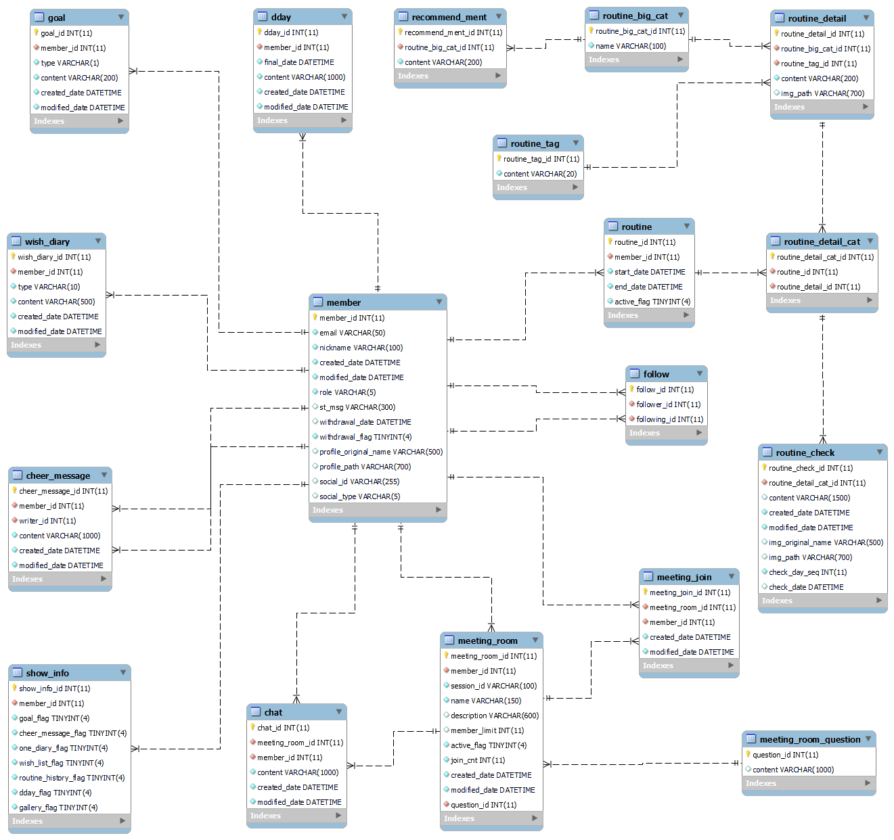

# 포팅 매뉴얼

🗓️ 작성일    2023.08.16

👥 작성자    권민정

📄 제목        **오늘도, 안녕** 포팅 매뉴얼

---
<aside>

### 💡 1. 개발 환경

</aside>

1.1 운영체제

- Windows 10

1.2 IDE

- IntelliJ IDEA 2023.1.3 (Ultimate Edition)
- Visual Studio Code 1.81.1

1.3 UI/UX

- Figma

1.4 Back-End

- Javac flag: -parameters
- Java SE Development Kit 11.0.19
- Spring Boot 2.7.14
    - Spring Boot DevTools
    - Spring Web
    - Lombok
    - MySQL Driver
    - Spring Data JPA
    - Spring Data Redis
    - Spring Security
- Gradle 8.1.1
- Apache Tomcat 9.0.78
- Json In Java 20160810
- JJWT 0.9.1
- Openvidu-Java-Client 2.28.0

1.5 Front-End

- Node 18.16.1
- React 18.2.0
- React-Router-Dom 6.14.2
- Redux 4.2.1
- Axios 1.4.0
- Openvidu-Browser 2.28.0

1.6 데이터베이스

- MySQL 5.7.35
- Redis 7.0.12

1.7 프로젝트 관리

- Gitlab
- Jira
- Google Drive

1.8 커뮤니케이션

- Notion
- Mattermost
- Discord

<aside>

<br/>


### 💡 2. 운영 환경

</aside>

- AWS EC2(Ubuntu 20.04 LTS)
- Nginx 1.18.0
- Docker 24.0.5
- Redis 7.0.12

<aside>

<br/>


### 💡 3. EC2 사용 포트

</aside>

| 포트 | 설명 |
| --- | --- |
| 22 | SSH |
| 80 | HTTP |
| 443 | HTTPS |
| 3000 | React |
| 3306 | MySQL |
| 8080 | Spring Boot |
| 8444 | Openvidu HTTP |
| 8445 | Openvidu HTTPS |
| 59465 | Redis |

<aside>

<br/>


### 💡 4. Nginx 설정

</aside>

4.1 /etc/nginx/sites-available/default 파일에 도메인 설정

```bash
server {
		listen 80;
	  server_name i9b308.p.ssafy.io;
		...
}
```

4.2 Nginx 리로드하여 default파일 설정 적용

```bash
# default 파일이 정상적인지 테스트
$ sudo nginx -t

# 리로드
$ sudo service nginx reload
```

4.3 SSL 인증서 발급(Certbot으로 Nginx에 SSL 인증서 자동 적용)

```bash
# Let's Encrypt 설치
$ sudo apt-get install letsencrypt

# Certbot 설치
sudo apt-get install certbot python3-certbot-nginx

# Certbot 동작
sudo certbot --nginx
```

4.4 SSL 인증서 적용 후 최종적으로 설정한 /etc/nginx/sites-available/default 파일

```bash
server {
        root /var/www/html;

        index index.html index.htm index.nginx-debian.html;

        server_name i9b308.p.ssafy.io;

        location / {
                # First attempt to serve request as file, then
                # as directory, then fall back to displaying a 404.
                # try_files $uri $uri/ =404;
                proxy_pass      http://i9b308.p.ssafy.io:3000;
        }

        location /api {
                proxy_pass      http://i9b308.p.ssafy.io:8080;
        }

        location /profile {
                proxy_pass      http://i9b308.p.ssafy.io:8080;
        }

        location /routine {
                proxy_pass      http://i9b308.p.ssafy.io:8080;
        }

    listen [::]:443 ssl ipv6only=on; # managed by Certbot
    listen 443 ssl; # managed by Certbot
    ssl_certificate /etc/letsencrypt/live/i9b308.p.ssafy.io/fullchain.pem; # managed by Certbot
    ssl_certificate_key /etc/letsencrypt/live/i9b308.p.ssafy.io/privkey.pem; # managed by Certbot
    include /etc/letsencrypt/options-ssl-nginx.conf; # managed by Certbot
    ssl_dhparam /etc/letsencrypt/ssl-dhparams.pem; # managed by Certbot

}

server {
    if ($host = i9b308.p.ssafy.io) {
        return 301 https://$host$request_uri;
    } # managed by Certbot

        listen 80 default_server;
        listen [::]:80 default_server;

        server_name i9b308.p.ssafy.io;
    return 404; # managed by Certbot

}
```

<aside>

<br/>


### 💡 5. Docker 컨테이너

</aside>

5.1 Jenkins

```bash
# jenkins 이미지 pull
$ sudo docker pull jenkins/jenkins:jdk11

# jenkins 컨테이너 실행 
$ sudo docker run -d -p 9090:8080 -v /home/ubuntu/jenkins:/var/jenkins_home --name jenkins -u root jenkins/jenkins:jdk11
```

- EC2 서버의 /home/ubuntu/jenkins와 docker 컨테이너의 /var/jenkins_home를 볼륨으로 연결하여 workspace에 생성되는 프로젝트 빌드 파일을 관리

5.1.1 사용된 주요 플러그인

- Gradle Plugin 2.8.2
- NodeJS Plugin 1.6.0
- SSH Agent Plugin 333.v878b_53c89511
- GitLab Plugin 1.7.15

5.1.2 Item

- Item1: hellotoday-be
    - 백엔드 프로젝트 정상 배포를 위해서 EC2 서버의 적절한 위치에 **Dockerfile, deploy.sh** 파일이 위치해 있어야 함(5.1.3 참고)
    - Pipeline script
        
        ```bash
        pipeline {
            agent any
        
            tools {
                gradle 'gradle'
            }
        
            stages {
                stage('Git Clone') {
                    steps {
                        git branch: 'master', credentialsId: 'gitlab_credentials', url: 'https://lab.ssafy.com/s09-webmobile1-sub2/S09P12B308.git'
                    }
                }
                
                stage('Build BE') {
                    steps {
                        dir("./BE/HelloToday") {
                            sh "gradle clean build"
                        }
                    }
                    
                    post {
                        success {
                            echo 'gradle build success'
                        }
        
                        failure {
                            echo 'gradle build failed'
                        }
                    }
                }
                
        				// ec2 서버 deploy.sh 실행
                stage('Deploy') {
                    steps {
                        sshagent(credentials: ['ssh_user']) {
                            sh """
                                ssh -o StrictHostKeyChecking=no ubuntu@i9b308.p.ssafy.io
                                ssh -t ubuntu@i9b308.p.ssafy.io /home/ubuntu/hello_today/be/deploy.sh
                            """
                        }
                    }
                    
                    post {
                        success {
                            echo 'success'
                        }
        
                        failure {
                            echo 'failed'
                        }
                    }
                }
                
            }
        }
        ```
        
    
- Item2: hellotoday-fe
    - 프론트엔드 프로젝트 정상 배포를 위해서 EC2 서버의 적절한 위치에 **Dockerfile, deploy.sh, .env** 파일이 위치해 있어야 함(5.1.3, 10.2 참고)
    - Pipeline script
        
        ```bash
        pipeline {
            agent any
            stages {
                stage('Git Clone') {
                    steps {
                        git branch: 'master', credentialsId: 'gitlab_credentials', url: 'https://lab.ssafy.com/s09-webmobile1-sub2/S09P12B308.git'
                    }
                }
                
                stage('Build FE') {
                    steps {
                        sh 'cp ../.env ./FE/HelloToday'
                        dir("./FE/HelloToday") {
                            nodejs(nodeJSInstallationName: 'NodeJS') {
                                sh 'CI=false npm install && CI=false npm run build'
                            }
                        }
                    }
                }
                
                stage('Compression') {
                    steps {
                        dir("./FE/HelloToday") {
                            sh '''
                                rm -rf node_modules
                                tar -cvf hellotoday.tar .
                            '''
                        }
                    }
                }
                
                // ec2 서버 deploy.sh 실행
                stage('Deploy') {
                    steps {
                        sshagent(credentials: ['ssh_user']) {
                            sh """
                                ssh -o StrictHostKeyChecking=no ubuntu@i9b308.p.ssafy.io
                                ssh -t ubuntu@i9b308.p.ssafy.io /home/ubuntu/hello_today/fe/deploy.sh
                            """
                        }
                    }
                    
                    post {
                        success {
                            echo 'success'
                        }
        
                        failure {
                            echo 'failed'
                        }
                    }
                }
            }
        }
        ```
        
    

5.1.3 Dockerfile & deploy.sh 생성

- EC2 폴더 구조
    
    ```bash
    /home/ubuntu
    ├── hello_today
    │   ├── be
    │   │   ├── Dockerfile
    │   │   ├── HelloToday-0.0.1-SNAPSHOT.jar    # Spring Boot jar 파일
    │   │   └── deploy.sh
    │   ├── db    # MySQL 컨테이너에서 사용하는 볼륨
    │   │   ├── hello_today_ddl.sql
    │   │   └── hello_today_dml.sql
    │   ├── fe
    │   │   ├── Dockerfile
    │   │   ├── deploy.sh
    │   │   ├── hello-today-fe   # React 빌드 압축 파일이 위치하는 폴더
    │   │   └── hellotoday.conf  # React 컨테이너가 사용할 Nginx 커스텀 설정 파일
    │   └── upload    # Spring Boot 컨테이너에서 사용하는 볼륨
    │       └── routine
    ├── jenkins    # jenkins 컨테이너에서 사용하는 볼륨
    │   └── workspace
    │       ├── .env    # 프론트엔드 환경 변수(운영 환경) .env 파일 위치
    │       ├── hellotoday-be
    │       └── hellotoday-fe
    └── upload    # Spring Boot 컨테이너에서 프로필 이미지 저장소로 사용하는 볼륨
        └── routine    # Spring Boot 컨테이너에서 루틴 인증 이미지 저장소로 사용하는 볼륨
    ```
    

- Dockerfile
    - BE
    
    ```bash
    FROM openjdk:11-jdk
    COPY HelloToday-0.0.1-SNAPSHOT.jar app.jar
    ENTRYPOINT ["java","-jar", "-Duser.timezone=Asia/Seoul", "-Dfile.encoding=UTF-8", "/app.jar"]
    ```
    
    - FE
    
    ```bash
    FROM node:18.16.1 as build
    WORKDIR /app
    COPY hello-today-fe/package.json hello-today-fe/package-lock.json ./
    RUN npm install
    
    # 나머지 파일들을 빌드 컨텍스트로 복사
    COPY hello-today-fe .
    RUN npm run build
    
    # 런타임 이미지 설정
    FROM nginx:latest
    
    # 빌드한 리액트 앱 파일을 Nginx의 정적 파일 디렉토리로 복사
    COPY --from=build /app/build /usr/share/nginx/html
    
    COPY hellotoday.conf /etc/nginx/conf.d/default.conf
    # EXPOSE 80
    
    # Nginx 실행
    CMD ["nginx", "-g", "daemon off;"]
    ```
    
- deploy.sh(소유자에게 파일 실행 권한 필요: -rwxrw-r—)
    - BE
    
    ```bash
    sudo docker stop hello-today-be
    sudo docker rm hello-today-be
    sudo docker rmi hello-today-be
    cd /home/ubuntu/hello_today/be
    cp /home/ubuntu/jenkins/workspace/hellotoday-be/BE/HelloToday/build/libs/HelloToday-0.0.1-SNAPSHOT.jar .
    sudo docker build -t hello-today-be .
    sudo docker run -d --name hello-today-be -v /home/ubuntu/upload:/hello_today/upload -v /home/ubuntu/upload/routine:/hello_today/upload/routine -p 8080:8080 hello-today-be
    ```
    
    - FE
    
    ```bash
    cd /home/ubuntu/hello_today/fe
    sudo rm  -r hello-today-fe
    mkdir hello-today-fe
    cp /home/ubuntu/jenkins/workspace/hellotoday-fe/FE/HelloToday/hellotoday.tar hello-today-fe
    cd hello-today-fe
    
    tar -xvf hellotoday.tar
    rm -rf hellotoday.tar
    
    cd ..
    
    sudo docker stop hello-today-fe
    sudo docker rm hello-today-fe
    sudo docker rmi hello-today-fe
    sudo docker build -t hello-today-fe .
    sudo docker run -d --name hello-today-fe -p 3000:80 hello-today-fe
    ```
    

5.2 Mysql 컨테이너

```bash
# mysql 이미지 pull
$ sudo docker pull mysql:5.7

# mysql 컨테이너 실행 
$ sudo docker run --name mysql -e MYSQL_ROOT_PASSWORD=hellotoday8dndhkdrnt22 -e LANG=C.UTF-8 -d -v /home/ubuntu/hello_today/db:/db -p 3306:3306 mysql:5.7 --character-set-server=utf8mb4 --collation-server=utf8mb4_unicode_ci
```

- EC2 서버의 /home/ubuntu/hello_today/db와 docker 컨테이너의 /db를 볼륨으로 연결하여 ddl, dml 등의 sql 스크립트를 관리

5.3 React 컨테이너

```bash
# Jenkins 없이 수동 실행 시

# 도커파일로부터 이미지 빌드
sudo docker build -t hello-today-fe .

# React 컨테이너 실행
sudo docker run -d --name hello-today-fe -p 3000:80 hello-today-fe
```

5.3.1 Nginx 커스텀 설정 파일(hellotoday.conf)

```bash
server {
  listen 80;
  server_name i9b308.p.ssafy.io;

  location / {
    root   /usr/share/nginx/html;
    index  index.html index.htm;
    try_files $uri /index.html;
  }

  error_page   500 502 503 504  /50x.html;
  location = /50x.html {
    root   /usr/share/nginx/html;
  }
}
```

5.4 Spring Boot 컨테이너

```bash
# Jenkins 없이 수동 실행 시

# 도커파일로부터 이미지 빌드
sudo docker build -t hello-today-be .

# Spring Boot 컨테이너 실행
sudo docker run -d --name hello-today-be -v /home/ubuntu/upload:/hello_today/upload -v /home/ubuntu/upload/routine:/hello_today/upload/routine -p 8080:8080 hello-today-be
```

<aside>

<br/>


### 💡 6. Openvidu 배포

</aside>

- 배포 메뉴얼
    
    [On premises - OpenVidu Docs](https://docs.openvidu.io/en/stable/deployment/ce/on-premises/#2-deployment)
    

```bash
# Openvidu 배포 초기 진행 시, 80, 443 포트를 사용하므로 기존에 해당 포트를 사용하고 있는 Nginx를 중지한 후 진행
$ sudo service nginx stop

# Openvidu 메뉴얼에 따라 배포 진행

# 포트 열기
$ ufw allow ssh
$ ufw allow 80/tcp
$ ufw allow 443/tcp
$ ufw allow 3478/tcp
$ ufw allow 3478/udp
$ ufw allow 40000:57000/tcp
$ ufw allow 40000:57000/udp
$ ufw allow 57001:65535/tcp
$ ufw allow 57001:65535/udp
$ ufw enable

# 루트 계정
$ sudo su

$ cd /opt

# 오픈비두 설치
$ curl https://s3-eu-west-1.amazonaws.com/aws.openvidu.io/install_openvidu_latest.sh | bash

$ cd openvidu

# .env 파일 내용 변경
# DOMAIN_OR_PUBLiC_IP=도메인
# OPENVIDU_SECRET=OpenVidu 비밀번호
# CERTIFICATE_TYPE=letsencrypt
# LETSENCRYPT_EMAIL=인증서 발급 시 사용한 이메일
# HTTP_PORT 8444, HTTPS_PORT 8445
$ sudo vi .env

# 오픈비두 시작
$ ./openvidu start

# Nginx 시작
$ sudo service nginx start

# 오픈비두 종료 시
$ ./openvidu stop
```

<aside>

<br/>


### 💡 7. MySQL 설정

</aside>

7.1 ERD



7.2 로컬 환경 계정

- database: hello_today
- host: localhost
- port: 3306
- username: ssafy
- password: ssafy

7.3 운영 환경 계정

- database: hello_today
- host: i9b308.p.ssafy.io
- port: 3306
- username: hello_today_308_team
- password: ssafytoday8dndhkdrnt22

7.4 DDL

```sql
-- MySQL Workbench Forward Engineering

SET @OLD_UNIQUE_CHECKS=@@UNIQUE_CHECKS, UNIQUE_CHECKS=0;
SET @OLD_FOREIGN_KEY_CHECKS=@@FOREIGN_KEY_CHECKS, FOREIGN_KEY_CHECKS=0;
SET @OLD_SQL_MODE=@@SQL_MODE, SQL_MODE='ONLY_FULL_GROUP_BY,STRICT_TRANS_TABLES,NO_ZERO_IN_DATE,NO_ZERO_DATE,ERROR_FOR_DIVISION_BY_ZERO,NO_ENGINE_SUBSTITUTION';

-- -----------------------------------------------------
-- Schema mydb
-- -----------------------------------------------------
-- -----------------------------------------------------
-- Schema hello_today
-- -----------------------------------------------------
DROP SCHEMA IF EXISTS `hello_today` ;

-- -----------------------------------------------------
-- Schema hello_today
-- -----------------------------------------------------
CREATE SCHEMA IF NOT EXISTS `hello_today` DEFAULT CHARACTER SET utf8mb4 ;
USE `hello_today` ;

-- -----------------------------------------------------
-- Table `hello_today`.`meeting_room_question`
-- -----------------------------------------------------
CREATE TABLE IF NOT EXISTS `hello_today`.`meeting_room_question` (
  `question_id` INT(11) NOT NULL AUTO_INCREMENT,
  `content` VARCHAR(1000) NULL DEFAULT NULL,
  PRIMARY KEY (`question_id`))
ENGINE = InnoDB
DEFAULT CHARACTER SET = utf8mb4;

-- -----------------------------------------------------
-- Table `hello_today`.`member`
-- -----------------------------------------------------
CREATE TABLE IF NOT EXISTS `hello_today`.`member` (
  `member_id` INT(11) NOT NULL AUTO_INCREMENT,
  `email` VARCHAR(50) NOT NULL,
  `nickname` VARCHAR(100) NOT NULL,
  `created_date` DATETIME NOT NULL,
  `modified_date` DATETIME NOT NULL,
  `role` VARCHAR(5) NOT NULL,
  `st_msg` VARCHAR(300) NULL DEFAULT NULL,
  `withdrawal_date` DATETIME NULL DEFAULT NULL,
  `withdrawal_flag` TINYINT(4) NOT NULL DEFAULT '0',
  `profile_original_name` VARCHAR(500) NULL DEFAULT NULL,
  `profile_path` VARCHAR(700) NULL DEFAULT NULL,
  `social_id` VARCHAR(255) NULL DEFAULT NULL,
  `social_type` VARCHAR(5) NULL DEFAULT NULL,
  PRIMARY KEY (`member_id`))
ENGINE = InnoDB
DEFAULT CHARACTER SET = utf8mb4;

-- -----------------------------------------------------
-- Table `hello_today`.`meeting_room`
-- -----------------------------------------------------
CREATE TABLE IF NOT EXISTS `hello_today`.`meeting_room` (
  `meeting_room_id` INT(11) NOT NULL AUTO_INCREMENT,
  `member_id` INT(11) NOT NULL,
  `session_id` VARCHAR(100) NOT NULL,
  `name` VARCHAR(150) NOT NULL,
  `description` VARCHAR(600) NULL,
  `member_limit` INT(11) NULL DEFAULT NULL,
  `active_flag` TINYINT(4) NOT NULL DEFAULT '1',
  `join_cnt` INT(11) NOT NULL DEFAULT '1',
  `created_date` DATETIME NOT NULL,
  `modified_date` DATETIME NOT NULL,
  `question_id` INT(11) NOT NULL,
  PRIMARY KEY (`meeting_room_id`),
  INDEX `fk_meeting_room_member1_idx` (`member_id` ASC),
  INDEX `fk_meeting_room_meeting_room_question1_idx` (`question_id` ASC),
  CONSTRAINT `fk_meeting_room_meeting_room_question1`
    FOREIGN KEY (`question_id`)
    REFERENCES `hello_today`.`meeting_room_question` (`question_id`)
    ON DELETE NO ACTION
    ON UPDATE NO ACTION,
  CONSTRAINT `fk_meeting_room_member1`
    FOREIGN KEY (`member_id`)
    REFERENCES `hello_today`.`member` (`member_id`)
    ON DELETE CASCADE
    ON UPDATE NO ACTION)
ENGINE = InnoDB
DEFAULT CHARACTER SET = utf8mb4;

-- -----------------------------------------------------
-- Table `hello_today`.`chat`
-- -----------------------------------------------------
CREATE TABLE IF NOT EXISTS `hello_today`.`chat` (
  `chat_id` INT(11) NOT NULL,
  `meeting_room_id` INT(11) NOT NULL,
  `member_id` INT(11) NOT NULL,
  `content` VARCHAR(1000) NOT NULL,
  `created_date` DATETIME NOT NULL,
  `modified_date` DATETIME NOT NULL,
  PRIMARY KEY (`chat_id`),
  INDEX `fk_chat_meeting_room1_idx` (`meeting_room_id` ASC),
  INDEX `fk_chat_member1_idx` (`member_id` ASC),
  CONSTRAINT `fk_chat_meeting_room1`
    FOREIGN KEY (`meeting_room_id`)
    REFERENCES `hello_today`.`meeting_room` (`meeting_room_id`)
    ON DELETE CASCADE
    ON UPDATE NO ACTION,
  CONSTRAINT `fk_chat_member1`
    FOREIGN KEY (`member_id`)
    REFERENCES `hello_today`.`member` (`member_id`)
    ON DELETE CASCADE
    ON UPDATE NO ACTION)
ENGINE = InnoDB
DEFAULT CHARACTER SET = utf8mb4;

-- -----------------------------------------------------
-- Table `hello_today`.`cheer_message`
-- -----------------------------------------------------
CREATE TABLE IF NOT EXISTS `hello_today`.`cheer_message` (
  `cheer_message_id` INT(11) NOT NULL AUTO_INCREMENT,
  `member_id` INT(11) NOT NULL,
  `writer_id` INT(11) NOT NULL,
  `content` VARCHAR(1000) NOT NULL,
  `created_date` DATETIME NOT NULL,
  `modified_date` DATETIME NOT NULL,
  PRIMARY KEY (`cheer_message_id`),
  INDEX `fk_cheer_message_member1_idx` (`member_id` ASC),
  INDEX `fk_cheer_message_member2_idx` (`writer_id` ASC),
  CONSTRAINT `fk_cheer_message_member1`
    FOREIGN KEY (`member_id`)
    REFERENCES `hello_today`.`member` (`member_id`)
    ON DELETE CASCADE
    ON UPDATE NO ACTION,
  CONSTRAINT `fk_cheer_message_member2`
    FOREIGN KEY (`writer_id`)
    REFERENCES `hello_today`.`member` (`member_id`)
    ON DELETE CASCADE
    ON UPDATE NO ACTION)
ENGINE = InnoDB
DEFAULT CHARACTER SET = utf8mb4;

-- -----------------------------------------------------
-- Table `hello_today`.`dday`
-- -----------------------------------------------------
CREATE TABLE IF NOT EXISTS `hello_today`.`dday` (
  `dday_id` INT(11) NOT NULL AUTO_INCREMENT,
  `member_id` INT(11) NOT NULL,
  `final_date` DATETIME NOT NULL,
  `content` VARCHAR(1000) NOT NULL,
  `created_date` DATETIME NOT NULL,
  `modified_date` DATETIME NOT NULL,
  PRIMARY KEY (`dday_id`),
  INDEX `fk_dday_member1_idx` (`member_id` ASC),
  CONSTRAINT `fk_dday_member1`
    FOREIGN KEY (`member_id`)
    REFERENCES `hello_today`.`member` (`member_id`)
    ON DELETE CASCADE
    ON UPDATE NO ACTION)
ENGINE = InnoDB
DEFAULT CHARACTER SET = utf8mb4;

-- -----------------------------------------------------
-- Table `hello_today`.`follow`
-- -----------------------------------------------------
CREATE TABLE IF NOT EXISTS `hello_today`.`follow` (
  `follow_id` INT(11) NOT NULL AUTO_INCREMENT,
  `follower_id` INT(11) NOT NULL,
  `following_id` INT(11) NOT NULL,
  PRIMARY KEY (`follow_id`),
  INDEX `fk_follow_member1_idx` (`follower_id` ASC),
  INDEX `fk_follow_member2_idx` (`following_id` ASC),
  CONSTRAINT `fk_follow_member1`
    FOREIGN KEY (`follower_id`)
    REFERENCES `hello_today`.`member` (`member_id`)
    ON DELETE CASCADE
    ON UPDATE NO ACTION,
  CONSTRAINT `fk_follow_member2`
    FOREIGN KEY (`following_id`)
    REFERENCES `hello_today`.`member` (`member_id`)
    ON DELETE CASCADE
    ON UPDATE NO ACTION)
ENGINE = InnoDB
DEFAULT CHARACTER SET = utf8mb4;

-- -----------------------------------------------------
-- Table `hello_today`.`goal`
-- -----------------------------------------------------
CREATE TABLE IF NOT EXISTS `hello_today`.`goal` (
  `goal_id` INT(11) NOT NULL AUTO_INCREMENT,
  `member_id` INT(11) NOT NULL,
  `type` VARCHAR(1) NOT NULL,
  `content` VARCHAR(200) NOT NULL,
  `created_date` DATETIME NOT NULL,
  `modified_date` DATETIME NOT NULL,
  PRIMARY KEY (`goal_id`, `member_id`),
  INDEX `fk_goal_member_idx` (`member_id` ASC),
  CONSTRAINT `fk_goal_member`
    FOREIGN KEY (`member_id`)
    REFERENCES `hello_today`.`member` (`member_id`)
    ON DELETE CASCADE
    ON UPDATE NO ACTION)
ENGINE = InnoDB
DEFAULT CHARACTER SET = utf8mb4;

-- -----------------------------------------------------
-- Table `hello_today`.`meeting_join`
-- -----------------------------------------------------
CREATE TABLE IF NOT EXISTS `hello_today`.`meeting_join` (
  `meeting_join_id` INT(11) NOT NULL,
  `meeting_room_id` INT(11) NOT NULL,
  `member_id` INT(11) NOT NULL,
  `created_date` DATETIME NOT NULL,
  `modified_date` DATETIME NOT NULL,
  PRIMARY KEY (`meeting_join_id`),
  INDEX `fk_meeting_join_meeting_room1_idx` (`meeting_room_id` ASC),
  INDEX `fk_meeting_join_member1_idx` (`member_id` ASC),
  CONSTRAINT `fk_meeting_join_meeting_room1`
    FOREIGN KEY (`meeting_room_id`)
    REFERENCES `hello_today`.`meeting_room` (`meeting_room_id`)
    ON DELETE CASCADE
    ON UPDATE NO ACTION,
  CONSTRAINT `fk_meeting_join_member1`
    FOREIGN KEY (`member_id`)
    REFERENCES `hello_today`.`member` (`member_id`)
    ON DELETE CASCADE
    ON UPDATE NO ACTION)
ENGINE = InnoDB
DEFAULT CHARACTER SET = utf8mb4;

-- -----------------------------------------------------
-- Table `hello_today`.`routine_big_cat`
-- -----------------------------------------------------
CREATE TABLE IF NOT EXISTS `hello_today`.`routine_big_cat` (
  `routine_big_cat_id` INT(11) NOT NULL AUTO_INCREMENT,
  `name` VARCHAR(100) NOT NULL,
  PRIMARY KEY (`routine_big_cat_id`))
ENGINE = InnoDB
DEFAULT CHARACTER SET = utf8mb4;

-- -----------------------------------------------------
-- Table `hello_today`.`recommend_ment`
-- -----------------------------------------------------
CREATE TABLE IF NOT EXISTS `hello_today`.`recommend_ment` (
  `recommend_ment_id` INT(11) NOT NULL AUTO_INCREMENT,
  `routine_big_cat_id` INT(11) NOT NULL,
  `content` VARCHAR(200) NOT NULL,
  PRIMARY KEY (`recommend_ment_id`),
  INDEX `fk_recommend_ment_routine_big_cat1_idx` (`routine_big_cat_id` ASC),
  CONSTRAINT `fk_recommend_ment_routine_big_cat1`
    FOREIGN KEY (`routine_big_cat_id`)
    REFERENCES `hello_today`.`routine_big_cat` (`routine_big_cat_id`)
    ON DELETE NO ACTION
    ON UPDATE NO ACTION)
ENGINE = InnoDB
DEFAULT CHARACTER SET = utf8mb4;

-- -----------------------------------------------------
-- Table `hello_today`.`routine`
-- -----------------------------------------------------
CREATE TABLE IF NOT EXISTS `hello_today`.`routine` (
  `routine_id` INT(11) NOT NULL AUTO_INCREMENT,
  `member_id` INT(11) NOT NULL,
  `start_date` DATETIME NOT NULL,
  `end_date` DATETIME NOT NULL,
  `active_flag` TINYINT(4) NOT NULL DEFAULT '1',
  PRIMARY KEY (`routine_id`),
  INDEX `fk_routine_member1_idx` (`member_id` ASC),
  CONSTRAINT `fk_routine_member1`
    FOREIGN KEY (`member_id`)
    REFERENCES `hello_today`.`member` (`member_id`)
    ON DELETE CASCADE
    ON UPDATE NO ACTION)
ENGINE = InnoDB
DEFAULT CHARACTER SET = utf8mb4;

-- -----------------------------------------------------
-- Table `hello_today`.`routine_tag`
-- -----------------------------------------------------
CREATE TABLE IF NOT EXISTS `hello_today`.`routine_tag` (
  `routine_tag_id` INT(11) NOT NULL AUTO_INCREMENT,
  `content` VARCHAR(20) NOT NULL,
  PRIMARY KEY (`routine_tag_id`))
ENGINE = InnoDB
DEFAULT CHARACTER SET = utf8mb4;

-- -----------------------------------------------------
-- Table `hello_today`.`routine_detail`
-- -----------------------------------------------------
CREATE TABLE IF NOT EXISTS `hello_today`.`routine_detail` (
  `routine_detail_id` INT(11) NOT NULL AUTO_INCREMENT,
  `routine_big_cat_id` INT(11) NOT NULL,
  `routine_tag_id` INT(11) NOT NULL,
  `content` VARCHAR(200) NOT NULL,
  `img_path` VARCHAR(700) NULL DEFAULT NULL,
  PRIMARY KEY (`routine_detail_id`),
  INDEX `fk_routine_detail_routine_big_cat1_idx` (`routine_big_cat_id` ASC),
  INDEX `fk_routine_detail_routine_tag1_idx` (`routine_tag_id` ASC),
  CONSTRAINT `fk_routine_detail_routine_big_cat1`
    FOREIGN KEY (`routine_big_cat_id`)
    REFERENCES `hello_today`.`routine_big_cat` (`routine_big_cat_id`)
    ON DELETE NO ACTION
    ON UPDATE NO ACTION,
  CONSTRAINT `fk_routine_detail_routine_tag1`
    FOREIGN KEY (`routine_tag_id`)
    REFERENCES `hello_today`.`routine_tag` (`routine_tag_id`)
    ON DELETE NO ACTION
    ON UPDATE NO ACTION)
ENGINE = InnoDB
DEFAULT CHARACTER SET = utf8mb4;

-- -----------------------------------------------------
-- Table `hello_today`.`routine_detail_cat`
-- -----------------------------------------------------
CREATE TABLE IF NOT EXISTS `hello_today`.`routine_detail_cat` (
  `routine_detail_cat_id` INT(11) NOT NULL AUTO_INCREMENT,
  `routine_id` INT(11) NOT NULL,
  `routine_detail_id` INT(11) NOT NULL,
  PRIMARY KEY (`routine_detail_cat_id`),
  INDEX `fk_routine_detail_cat_routine1_idx` (`routine_id` ASC),
  INDEX `fk_routine_detail_cat_routine_detail1_idx` (`routine_detail_id` ASC),
  CONSTRAINT `fk_routine_detail_cat_routine1`
    FOREIGN KEY (`routine_id`)
    REFERENCES `hello_today`.`routine` (`routine_id`)
    ON DELETE CASCADE
    ON UPDATE NO ACTION,
  CONSTRAINT `fk_routine_detail_cat_routine_detail1`
    FOREIGN KEY (`routine_detail_id`)
    REFERENCES `hello_today`.`routine_detail` (`routine_detail_id`)
    ON DELETE NO ACTION
    ON UPDATE NO ACTION)
ENGINE = InnoDB
DEFAULT CHARACTER SET = utf8mb4;

-- -----------------------------------------------------
-- Table `hello_today`.`routine_check`
-- -----------------------------------------------------
CREATE TABLE IF NOT EXISTS `hello_today`.`routine_check` (
  `routine_check_id` INT(11) NOT NULL AUTO_INCREMENT,
  `routine_detail_cat_id` INT(11) NOT NULL,
  `content` VARCHAR(1500) NULL DEFAULT NULL,
  `created_date` DATETIME NOT NULL,
  `modified_date` DATETIME NOT NULL,
  `img_original_name` VARCHAR(500) NULL DEFAULT NULL,
  `img_path` VARCHAR(700) NULL DEFAULT NULL,
  `check_day_seq` INT(11) NOT NULL,
  `check_date` DATETIME NULL DEFAULT NULL,
  PRIMARY KEY (`routine_check_id`),
  INDEX `fk_routine_check_routine_detail_cat1_idx` (`routine_detail_cat_id` ASC),
  CONSTRAINT `fk_routine_check_routine_detail_cat1`
    FOREIGN KEY (`routine_detail_cat_id`)
    REFERENCES `hello_today`.`routine_detail_cat` (`routine_detail_cat_id`)
    ON DELETE CASCADE
    ON UPDATE NO ACTION)
ENGINE = InnoDB
DEFAULT CHARACTER SET = utf8mb4;

-- -----------------------------------------------------
-- Table `hello_today`.`show_info`
-- -----------------------------------------------------
CREATE TABLE IF NOT EXISTS `hello_today`.`show_info` (
  `show_info_id` INT(11) NOT NULL AUTO_INCREMENT,
  `member_id` INT(11) NOT NULL,
  `goal_flag` TINYINT(4) NOT NULL DEFAULT '1',
  `cheer_message_flag` TINYINT(4) NOT NULL DEFAULT '1',
  `one_diary_flag` TINYINT(4) NOT NULL DEFAULT '1',
  `wish_list_flag` TINYINT(4) NOT NULL DEFAULT '1',
  `routine_history_flag` TINYINT(4) NOT NULL DEFAULT '1',
  `dday_flag` TINYINT(4) NOT NULL DEFAULT '1',
  `gallery_flag` TINYINT(4) NOT NULL DEFAULT '1',
  PRIMARY KEY (`show_info_id`),
  INDEX `fk_show_info_member1_idx` (`member_id` ASC),
  CONSTRAINT `fk_show_info_member1`
    FOREIGN KEY (`member_id`)
    REFERENCES `hello_today`.`member` (`member_id`)
    ON DELETE CASCADE
    ON UPDATE NO ACTION)
ENGINE = InnoDB
DEFAULT CHARACTER SET = utf8mb4;

-- -----------------------------------------------------
-- Table `hello_today`.`wish_diary`
-- -----------------------------------------------------
CREATE TABLE IF NOT EXISTS `hello_today`.`wish_diary` (
  `wish_diary_id` INT(11) NOT NULL AUTO_INCREMENT,
  `member_id` INT(11) NOT NULL,
  `type` VARCHAR(10) NOT NULL,
  `content` VARCHAR(500) NOT NULL,
  `created_date` DATETIME NOT NULL,
  `modified_date` DATETIME NOT NULL,
  PRIMARY KEY (`wish_diary_id`),
  INDEX `fk_wish_diary_member1_idx` (`member_id` ASC),
  CONSTRAINT `fk_wish_diary_member1`
    FOREIGN KEY (`member_id`)
    REFERENCES `hello_today`.`member` (`member_id`)
    ON DELETE CASCADE
    ON UPDATE NO ACTION)
ENGINE = InnoDB
DEFAULT CHARACTER SET = utf8mb4;

SET SQL_MODE=@OLD_SQL_MODE;
SET FOREIGN_KEY_CHECKS=@OLD_FOREIGN_KEY_CHECKS;
SET UNIQUE_CHECKS=@OLD_UNIQUE_CHECKS;
```

7.5 기본 DML

```sql
use hello_today;

-- 1. 이 방에는 각자 서로 다른 루틴을 진행하는 사람들이 모여있습니다. 서로 어떤 루틴을 진행하고 있는지 간단하게 공유하는 시간을 가져보아요.
INSERT INTO meeting_room_question (content) VALUES ('이 방에는 각자 서로 다른 루틴을 진행하는 사람들이 모여있습니다. 서로 어떤 루틴을 진행하고 있는지 간단하게 공유하는 시간을 가져보아요.');
-- 2. 각자 루틴을 며칠동안 꾸준히 진행했는지 말하는 시간을 가져보아요.
INSERT INTO meeting_room_question (content) VALUES ('각자 루틴을 며칠동안 꾸준히 진행했는지 말하는 시간을 가져보아요.');
-- 3. 현재 자신의 진행 상황에서 아쉬운 점과 잘 하고 있는 점을 공유해봅시다. (서로 격려하는 말도 해보는건 어떤가요?)
INSERT INTO meeting_room_question (content) VALUES ('현재 자신의 진행 상황에서 아쉬운 점과 잘 하고 있는 점을 공유해봅시다. (서로 격려하는 말도 해보는건 어떤가요?)');
-- 4. 처음 보는 사람들끼리 자신의 목표와 진행도를 공유하는 것은 굉장히 용기있는 행동이에요. 서로 응원을 하면서 회의를 해보는건 어떤가요?
INSERT INTO meeting_room_question (content) VALUES ('처음 보는 사람들끼리 자신의 목표와 진행도를 공유하는 것은 굉장히 용기있는 행동이에요. 서로 응원을 하면서 회의를 해보는건 어떤가요?');
-- 5. 루틴을 진행하며 일상의 소소한 재미를 느끼고 계신가요? 기억에 남는 루틴 실천 경험을 서로 공유해봅시다.
INSERT INTO meeting_room_question (content) VALUES ('루틴을 진행하며 일상의 소소한 재미를 느끼고 계신가요? 기억에 남는 루틴 실천 경험을 서로 공유해봅시다.');
-- 6. 앞으로 변화하고 싶은 나의 모습을 상상해보며 서로 이야기 해보는 시간을 가져볼까요?
INSERT INTO meeting_room_question (content) VALUES ('앞으로 변화하고 싶은 나의 모습을 상상해보며 서로 이야기 해보는 시간을 가져볼까요?');
-- 7. 루틴을 실천하는 의지를 꾸준히 이어나가기가 생각보다 어려울 거에요. 나만의 실천 노하우가 있다면 서로 공유해 보아요!
INSERT INTO meeting_room_question (content) VALUES ('루틴을 실천하는 의지를 꾸준히 이어나가기가 생각보다 어려울 거에요. 나만의 실천 노하우가 있다면 서로 공유해 보아요!');

-- 루틴 대분류
INSERT INTO `hello_today`.`routine_big_cat` (`name`) VALUES ('기본');
INSERT INTO `hello_today`.`routine_big_cat` (`name`) VALUES ('정적');
INSERT INTO `hello_today`.`routine_big_cat` (`name`) VALUES ('동적');

-- 루틴 태그
INSERT INTO `hello_today`.`routine_tag` (`content`) VALUES ('식사');
INSERT INTO `hello_today`.`routine_tag` (`content`) VALUES ('기상');
INSERT INTO `hello_today`.`routine_tag` (`content`) VALUES ('청소');
INSERT INTO `hello_today`.`routine_tag` (`content`) VALUES ('수면');
INSERT INTO `hello_today`.`routine_tag` (`content`) VALUES ('마음 챙김');
INSERT INTO `hello_today`.`routine_tag` (`content`) VALUES ('독서');
INSERT INTO `hello_today`.`routine_tag` (`content`) VALUES ('음악');
INSERT INTO `hello_today`.`routine_tag` (`content`) VALUES ('산책');
INSERT INTO `hello_today`.`routine_tag` (`content`) VALUES ('기록');
INSERT INTO `hello_today`.`routine_tag` (`content`) VALUES ('명상');
INSERT INTO `hello_today`.`routine_tag` (`content`) VALUES ('뉴스');
INSERT INTO `hello_today`.`routine_tag` (`content`) VALUES ('사진');
INSERT INTO `hello_today`.`routine_tag` (`content`) VALUES ('영화');
INSERT INTO `hello_today`.`routine_tag` (`content`) VALUES ('쇼핑');
INSERT INTO `hello_today`.`routine_tag` (`content`) VALUES ('운동');
INSERT INTO `hello_today`.`routine_tag` (`content`) VALUES ('그림');
INSERT INTO `hello_today`.`routine_tag` (`content`) VALUES ('기본');

-- 루틴 세분류
INSERT INTO `hello_today`.`routine_detail` (`routine_big_cat_id`, `routine_tag_id`, `content`,`img_path`) VALUES ('1', '17', '물 마시기','water.png');
INSERT INTO `hello_today`.`routine_detail` (`routine_big_cat_id`, `routine_tag_id`, `content`,`img_path`) VALUES ('1', '1', '밥 챙겨먹기','eatmeal.png');
INSERT INTO `hello_today`.`routine_detail` (`routine_big_cat_id`, `routine_tag_id`, `content`,`img_path`) VALUES ('1', '17', '샤워하기','shower.png');
INSERT INTO `hello_today`.`routine_detail` (`routine_big_cat_id`, `routine_tag_id`, `content`,`img_path`) VALUES ('1', '2', '규칙적인 기상하기','getup.png');
INSERT INTO `hello_today`.`routine_detail` (`routine_big_cat_id`, `routine_tag_id`, `content`,`img_path`) VALUES ('1', '4', '규칙적인 수면','sleep.png');
INSERT INTO `hello_today`.`routine_detail` (`routine_big_cat_id`, `routine_tag_id`, `content`,`img_path`) VALUES ('1', '3', '방 청소하기','cleaning.png');
INSERT INTO `hello_today`.`routine_detail` (`routine_big_cat_id`, `routine_tag_id`, `content`,`img_path`) VALUES ('1', '5', '스스로 칭찬하기','heart.png');
INSERT INTO `hello_today`.`routine_detail` (`routine_big_cat_id`, `routine_tag_id`, `content`,`img_path`) VALUES ('2', '6', '독서하기','book.png');
INSERT INTO `hello_today`.`routine_detail` (`routine_big_cat_id`, `routine_tag_id`, `content`,`img_path`) VALUES ('2', '7', '음악듣기','music.png');
INSERT INTO `hello_today`.`routine_detail` (`routine_big_cat_id`, `routine_tag_id`, `content`,`img_path`) VALUES ('2', '5', '감사일기 쓰기','thanxdiary.png');
INSERT INTO `hello_today`.`routine_detail` (`routine_big_cat_id`, `routine_tag_id`, `content`,`img_path`) VALUES ('2', '9', '하루 일과 기록하기','recordtoday.png');
INSERT INTO `hello_today`.`routine_detail` (`routine_big_cat_id`, `routine_tag_id`, `content`,`img_path`) VALUES ('2', '10', '10분간 명상하기','meditation.png');
INSERT INTO `hello_today`.`routine_detail` (`routine_big_cat_id`, `routine_tag_id`, `content`,`img_path`) VALUES ('2', '17', '지인에게 연락하기','phonecall.png');
INSERT INTO `hello_today`.`routine_detail` (`routine_big_cat_id`, `routine_tag_id`, `content`,`img_path`) VALUES ('2', '9', '버킷리스트 작성','bucketlist.png');
INSERT INTO `hello_today`.`routine_detail` (`routine_big_cat_id`, `routine_tag_id`, `content`,`img_path`) VALUES ('2', '11', '뉴스보기','news.png');
INSERT INTO `hello_today`.`routine_detail` (`routine_big_cat_id`, `routine_tag_id`, `content`,`img_path`) VALUES ('2', '12', '사진 찍기','takephoto.png');
INSERT INTO `hello_today`.`routine_detail` (`routine_big_cat_id`, `routine_tag_id`, `content`,`img_path`) VALUES ('2', '13', '영화보기','movie.png');
INSERT INTO `hello_today`.`routine_detail` (`routine_big_cat_id`, `routine_tag_id`, `content`,`img_path`) VALUES ('2', '14', '인터넷 쇼핑하기','shopping.png');
INSERT INTO `hello_today`.`routine_detail` (`routine_big_cat_id`, `routine_tag_id`, `content`,`img_path`) VALUES ('3', '15', '운동하기','exercise.png');
INSERT INTO `hello_today`.`routine_detail` (`routine_big_cat_id`, `routine_tag_id`, `content`,`img_path`) VALUES ('3', '16', '그림 그리기','drawing.png');
INSERT INTO `hello_today`.`routine_detail` (`routine_big_cat_id`, `routine_tag_id`, `content`,`img_path`) VALUES ('3', '16', '컬러링북 색칠하기','colorbook.png');
INSERT INTO `hello_today`.`routine_detail` (`routine_big_cat_id`, `routine_tag_id`, `content`,`img_path`) VALUES ('3', '7', '악기 배우기','instrument.png');
INSERT INTO `hello_today`.`routine_detail` (`routine_big_cat_id`, `routine_tag_id`, `content`,`img_path`) VALUES ('3', '15', '스트레칭하기','stretch.png');
INSERT INTO `hello_today`.`routine_detail` (`routine_big_cat_id`, `routine_tag_id`, `content`,`img_path`) VALUES ('3', '15', '자전거 타기','bike.png');
INSERT INTO `hello_today`.`routine_detail` (`routine_big_cat_id`, `routine_tag_id`, `content`,`img_path`) VALUES ('3', '1', '직접 식사 만들기','makemeal.png');
INSERT INTO `hello_today`.`routine_detail` (`routine_big_cat_id`, `routine_tag_id`, `content`,`img_path`) VALUES ('3', '8', '산책하기','strolling.png');

-- 루틴 추천 멘트
INSERT INTO `hello_today`.`recommend_ment` (`routine_big_cat_id`, `content`) VALUES ('2', '오늘도 활기찬 하루를 명상으로 시작해볼까요?');
INSERT INTO `hello_today`.`recommend_ment` (`routine_big_cat_id`, `content`) VALUES ('1', '하루의 시작과 끝을 루틴과 함께하며 건강한 삶을 만들어나가요.');
INSERT INTO `hello_today`.`recommend_ment` (`routine_big_cat_id`, `content`) VALUES ('2', '오늘 하루는 어떠셨나요? 오늘 자신의 이야기를 기록해봐요');
INSERT INTO `hello_today`.`recommend_ment` (`routine_big_cat_id`, `content`) VALUES ('1', '물마시기 같은 작은 습관으로 건강을 챙겨봐요.');
INSERT INTO `hello_today`.`recommend_ment` (`routine_big_cat_id`, `content`) VALUES ('1', '어렵지 않은 것부터 습관으로 만들어가는 것은 어떤가요?');
INSERT INTO `hello_today`.`recommend_ment` (`routine_big_cat_id`, `content`) VALUES ('1', '아침 침구 정리, 규칙적인 생활의 첫걸음입니다.');
INSERT INTO `hello_today`.`recommend_ment` (`routine_big_cat_id`, `content`) VALUES ('2', '날씨가 좋은 날, 상쾌한 공기를 쐬면서 기분 전환을 해봐요');
INSERT INTO `hello_today`.`recommend_ment` (`routine_big_cat_id`, `content`) VALUES ('2', '좋아하는 음악이 있으신가요? 오늘은 제일 좋아하는 노래를 들어봐요.');
INSERT INTO `hello_today`.`recommend_ment` (`routine_big_cat_id`, `content`) VALUES ('3', '운동을 하면서 체력을 길러봅시다!');
INSERT INTO `hello_today`.`recommend_ment` (`routine_big_cat_id`, `content`) VALUES ('3', '요리를 하면서 맛있는 음식을 만들어보는건 어떠신가요? 오늘은 내가 요리사~');
INSERT INTO `hello_today`.`recommend_ment` (`routine_big_cat_id`, `content`) VALUES ('3', '악기를 배우는게 스트레스에 도움이 된다고 해요. 새로운 악기를 배우는건 어떤가요?');
```

7.6 운영 환경 DB Dump

```sql
-- MySQL dump 10.13  Distrib 5.7.42, for Linux (x86_64)
--
-- Host: localhost    Database: hello_today
-- ------------------------------------------------------
-- Server version	5.7.42

/*!40101 SET @OLD_CHARACTER_SET_CLIENT=@@CHARACTER_SET_CLIENT */;
/*!40101 SET @OLD_CHARACTER_SET_RESULTS=@@CHARACTER_SET_RESULTS */;
/*!40101 SET @OLD_COLLATION_CONNECTION=@@COLLATION_CONNECTION */;
/*!40101 SET NAMES utf8 */;
/*!40103 SET @OLD_TIME_ZONE=@@TIME_ZONE */;
/*!40103 SET TIME_ZONE='+00:00' */;
/*!40014 SET @OLD_UNIQUE_CHECKS=@@UNIQUE_CHECKS, UNIQUE_CHECKS=0 */;
/*!40014 SET @OLD_FOREIGN_KEY_CHECKS=@@FOREIGN_KEY_CHECKS, FOREIGN_KEY_CHECKS=0 */;
/*!40101 SET @OLD_SQL_MODE=@@SQL_MODE, SQL_MODE='NO_AUTO_VALUE_ON_ZERO' */;
/*!40111 SET @OLD_SQL_NOTES=@@SQL_NOTES, SQL_NOTES=0 */;

--
-- Table structure for table `chat`
--

DROP TABLE IF EXISTS `chat`;
/*!40101 SET @saved_cs_client     = @@character_set_client */;
/*!40101 SET character_set_client = utf8 */;
CREATE TABLE `chat` (
  `chat_id` int(11) NOT NULL,
  `meeting_room_id` int(11) NOT NULL,
  `member_id` int(11) NOT NULL,
  `content` varchar(1000) NOT NULL,
  `created_date` datetime NOT NULL,
  `modified_date` datetime NOT NULL,
  PRIMARY KEY (`chat_id`),
  KEY `fk_chat_meeting_room1_idx` (`meeting_room_id`),
  KEY `fk_chat_member1_idx` (`member_id`),
  CONSTRAINT `fk_chat_meeting_room1` FOREIGN KEY (`meeting_room_id`) REFERENCES `meeting_room` (`meeting_room_id`) ON DELETE CASCADE ON UPDATE NO ACTION,
  CONSTRAINT `fk_chat_member1` FOREIGN KEY (`member_id`) REFERENCES `member` (`member_id`) ON DELETE CASCADE ON UPDATE NO ACTION
) ENGINE=InnoDB DEFAULT CHARSET=utf8mb4;
/*!40101 SET character_set_client = @saved_cs_client */;

--
-- Dumping data for table `chat`
--

LOCK TABLES `chat` WRITE;
/*!40000 ALTER TABLE `chat` DISABLE KEYS */;
/*!40000 ALTER TABLE `chat` ENABLE KEYS */;
UNLOCK TABLES;

--
-- Table structure for table `cheer_message`
--

DROP TABLE IF EXISTS `cheer_message`;
/*!40101 SET @saved_cs_client     = @@character_set_client */;
/*!40101 SET character_set_client = utf8 */;
CREATE TABLE `cheer_message` (
  `cheer_message_id` int(11) NOT NULL AUTO_INCREMENT,
  `member_id` int(11) NOT NULL,
  `writer_id` int(11) NOT NULL,
  `content` varchar(1000) NOT NULL,
  `created_date` datetime NOT NULL,
  `modified_date` datetime NOT NULL,
  PRIMARY KEY (`cheer_message_id`),
  KEY `fk_cheer_message_member1_idx` (`member_id`),
  KEY `fk_cheer_message_member2_idx` (`writer_id`),
  CONSTRAINT `fk_cheer_message_member1` FOREIGN KEY (`member_id`) REFERENCES `member` (`member_id`) ON DELETE CASCADE ON UPDATE NO ACTION,
  CONSTRAINT `fk_cheer_message_member2` FOREIGN KEY (`writer_id`) REFERENCES `member` (`member_id`) ON DELETE CASCADE ON UPDATE NO ACTION
) ENGINE=InnoDB AUTO_INCREMENT=22 DEFAULT CHARSET=utf8mb4;
/*!40101 SET character_set_client = @saved_cs_client */;

--
-- Dumping data for table `cheer_message`
--

LOCK TABLES `cheer_message` WRITE;
/*!40000 ALTER TABLE `cheer_message` DISABLE KEYS */;
INSERT INTO `cheer_message` VALUES (3,5,5,'하이하이요!','2023-08-11 12:52:20','2023-08-11 12:52:20'),(12,22,22,'응원 메시지 남겨요 하이!','2023-08-14 18:58:18','2023-08-15 16:32:59'),(13,4,1,'춘식이는 짱이에요!!','2023-08-15 10:40:42','2023-08-15 10:40:42'),(14,25,25,'jy','2023-08-15 14:30:17','2023-08-15 14:30:17'),(15,25,25,'ergerg','2023-08-15 17:01:17','2023-08-15 17:01:17'),(16,25,25,'ergerheth','2023-08-15 17:01:19','2023-08-15 17:01:19'),(17,25,25,'ergergerg','2023-08-15 17:01:21','2023-08-15 17:01:21'),(18,25,25,'ergerghtth','2023-08-15 17:01:26','2023-08-15 17:01:26'),(19,25,25,'rthetherh','2023-08-15 17:01:28','2023-08-15 17:01:28'),(20,25,25,'wewerwet','2023-08-15 17:01:30','2023-08-15 17:01:30'),(21,5,5,'안녕하세요 여러분! 반갑스빈다~','2023-08-16 10:26:16','2023-08-16 10:26:16');
/*!40000 ALTER TABLE `cheer_message` ENABLE KEYS */;
UNLOCK TABLES;

--
-- Table structure for table `dday`
--

DROP TABLE IF EXISTS `dday`;
/*!40101 SET @saved_cs_client     = @@character_set_client */;
/*!40101 SET character_set_client = utf8 */;
CREATE TABLE `dday` (
  `dday_id` int(11) NOT NULL AUTO_INCREMENT,
  `member_id` int(11) NOT NULL,
  `final_date` datetime NOT NULL,
  `content` varchar(1000) NOT NULL,
  `created_date` datetime NOT NULL,
  `modified_date` datetime NOT NULL,
  PRIMARY KEY (`dday_id`),
  KEY `fk_dday_member1_idx` (`member_id`),
  CONSTRAINT `fk_dday_member1` FOREIGN KEY (`member_id`) REFERENCES `member` (`member_id`) ON DELETE CASCADE ON UPDATE NO ACTION
) ENGINE=InnoDB AUTO_INCREMENT=10 DEFAULT CHARSET=utf8mb4;
/*!40101 SET character_set_client = @saved_cs_client */;

--
-- Dumping data for table `dday`
--

LOCK TABLES `dday` WRITE;
/*!40000 ALTER TABLE `dday` DISABLE KEYS */;
INSERT INTO `dday` VALUES (9,4,'2023-08-17 00:00:00','ㄴㅇㄹㄴㅇㄹ','2023-08-15 14:31:13','2023-08-15 14:31:13');
/*!40000 ALTER TABLE `dday` ENABLE KEYS */;
UNLOCK TABLES;

--
-- Table structure for table `follow`
--

DROP TABLE IF EXISTS `follow`;
/*!40101 SET @saved_cs_client     = @@character_set_client */;
/*!40101 SET character_set_client = utf8 */;
CREATE TABLE `follow` (
  `follow_id` int(11) NOT NULL AUTO_INCREMENT,
  `follower_id` int(11) NOT NULL,
  `following_id` int(11) NOT NULL,
  PRIMARY KEY (`follow_id`),
  KEY `fk_follow_member1_idx` (`follower_id`),
  KEY `fk_follow_member2_idx` (`following_id`),
  CONSTRAINT `fk_follow_member1` FOREIGN KEY (`follower_id`) REFERENCES `member` (`member_id`) ON DELETE CASCADE ON UPDATE NO ACTION,
  CONSTRAINT `fk_follow_member2` FOREIGN KEY (`following_id`) REFERENCES `member` (`member_id`) ON DELETE CASCADE ON UPDATE NO ACTION
) ENGINE=InnoDB AUTO_INCREMENT=71 DEFAULT CHARSET=utf8mb4;
/*!40101 SET character_set_client = @saved_cs_client */;

--
-- Dumping data for table `follow`
--

LOCK TABLES `follow` WRITE;
/*!40000 ALTER TABLE `follow` DISABLE KEYS */;
INSERT INTO `follow` VALUES (7,5,4),(24,5,2),(25,4,5),(44,1,12),(48,12,1),(57,2,1),(60,22,23),(61,23,22),(65,25,17),(66,26,1),(70,2,6);
/*!40000 ALTER TABLE `follow` ENABLE KEYS */;
UNLOCK TABLES;

--
-- Table structure for table `goal`
--

DROP TABLE IF EXISTS `goal`;
/*!40101 SET @saved_cs_client     = @@character_set_client */;
/*!40101 SET character_set_client = utf8 */;
CREATE TABLE `goal` (
  `goal_id` int(11) NOT NULL AUTO_INCREMENT,
  `member_id` int(11) NOT NULL,
  `type` varchar(1) NOT NULL,
  `content` varchar(200) NOT NULL,
  `created_date` datetime NOT NULL,
  `modified_date` datetime NOT NULL,
  PRIMARY KEY (`goal_id`,`member_id`),
  KEY `fk_goal_member_idx` (`member_id`),
  CONSTRAINT `fk_goal_member` FOREIGN KEY (`member_id`) REFERENCES `member` (`member_id`) ON DELETE CASCADE ON UPDATE NO ACTION
) ENGINE=InnoDB AUTO_INCREMENT=10 DEFAULT CHARSET=utf8mb4;
/*!40101 SET character_set_client = @saved_cs_client */;

--
-- Dumping data for table `goal`
--

LOCK TABLES `goal` WRITE;
/*!40000 ALTER TABLE `goal` DISABLE KEYS */;
INSERT INTO `goal` VALUES (2,2,'0','밥먹기','2023-08-14 02:04:58','2023-08-14 02:04:58'),(3,22,'0','매일 목표입니다.','2023-08-14 10:30:16','2023-08-14 10:30:16'),(4,22,'1','매주 목표입니다.','2023-08-14 10:30:25','2023-08-14 10:30:25'),(5,22,'2','매년 목표입니다.','2023-08-14 10:30:36','2023-08-14 10:30:36'),(6,22,'2','목표입니다.','2023-08-14 10:30:43','2023-08-14 10:30:43'),(7,1,'0','ㅅㄷㅅㄴㄷㅅㄴ','2023-08-14 10:34:03','2023-08-14 10:34:03'),(8,2,'0','fsdfs','2023-08-14 15:40:11','2023-08-14 15:40:11'),(9,2,'0','2112','2023-08-14 16:24:09','2023-08-14 16:24:09');
/*!40000 ALTER TABLE `goal` ENABLE KEYS */;
UNLOCK TABLES;

--
-- Table structure for table `meeting_join`
--

DROP TABLE IF EXISTS `meeting_join`;
/*!40101 SET @saved_cs_client     = @@character_set_client */;
/*!40101 SET character_set_client = utf8 */;
CREATE TABLE `meeting_join` (
  `meeting_join_id` int(11) NOT NULL,
  `meeting_room_id` int(11) NOT NULL,
  `member_id` int(11) NOT NULL,
  `created_date` datetime NOT NULL,
  `modified_date` datetime NOT NULL,
  PRIMARY KEY (`meeting_join_id`),
  KEY `fk_meeting_join_meeting_room1_idx` (`meeting_room_id`),
  KEY `fk_meeting_join_member1_idx` (`member_id`),
  CONSTRAINT `fk_meeting_join_meeting_room1` FOREIGN KEY (`meeting_room_id`) REFERENCES `meeting_room` (`meeting_room_id`) ON DELETE CASCADE ON UPDATE NO ACTION,
  CONSTRAINT `fk_meeting_join_member1` FOREIGN KEY (`member_id`) REFERENCES `member` (`member_id`) ON DELETE CASCADE ON UPDATE NO ACTION
) ENGINE=InnoDB DEFAULT CHARSET=utf8mb4;
/*!40101 SET character_set_client = @saved_cs_client */;

--
-- Dumping data for table `meeting_join`
--

LOCK TABLES `meeting_join` WRITE;
/*!40000 ALTER TABLE `meeting_join` DISABLE KEYS */;
/*!40000 ALTER TABLE `meeting_join` ENABLE KEYS */;
UNLOCK TABLES;

--
-- Table structure for table `meeting_room`
--

DROP TABLE IF EXISTS `meeting_room`;
/*!40101 SET @saved_cs_client     = @@character_set_client */;
/*!40101 SET character_set_client = utf8 */;
CREATE TABLE `meeting_room` (
  `meeting_room_id` int(11) NOT NULL AUTO_INCREMENT,
  `member_id` int(11) NOT NULL,
  `session_id` varchar(100) NOT NULL,
  `name` varchar(100) NOT NULL,
  `description` varchar(600) DEFAULT NULL,
  `member_limit` int(11) DEFAULT NULL,
  `active_flag` tinyint(4) NOT NULL DEFAULT '1',
  `join_cnt` int(11) NOT NULL DEFAULT '1',
  `created_date` datetime NOT NULL,
  `modified_date` datetime NOT NULL,
  `question_id` int(11) NOT NULL,
  PRIMARY KEY (`meeting_room_id`),
  KEY `fk_meeting_room_member1_idx` (`member_id`),
  KEY `fk_meeting_room_meeting_room_question1_idx` (`question_id`),
  CONSTRAINT `fk_meeting_room_meeting_room_question1` FOREIGN KEY (`question_id`) REFERENCES `meeting_room_question` (`question_id`) ON DELETE NO ACTION ON UPDATE NO ACTION,
  CONSTRAINT `fk_meeting_room_member1` FOREIGN KEY (`member_id`) REFERENCES `member` (`member_id`) ON DELETE CASCADE ON UPDATE NO ACTION
) ENGINE=InnoDB AUTO_INCREMENT=66 DEFAULT CHARSET=utf8mb4;
/*!40101 SET character_set_client = @saved_cs_client */;

--
-- Dumping data for table `meeting_room`
--

LOCK TABLES `meeting_room` WRITE;
/*!40000 ALTER TABLE `meeting_room` DISABLE KEYS */;
INSERT INTO `meeting_room` VALUES (20,1,'ses_KMC2sc4Wxd','동ㅎㅎ훈','ㅋㅎㅋㅎㅋㅎ',3,0,1,'2023-08-13 19:17:56','2023-08-13 19:24:42',2),(21,1,'ses_MsINCKRdLo','tetet','estsertestsrsrfs',4,0,1,'2023-08-13 19:26:56','2023-08-13 19:35:33',1),(23,1,'ses_TWgqP9iyFM','test','testsetest',1,1,1,'2023-08-13 20:28:07','2023-08-13 20:28:07',1),(24,1,'ses_ZqtNvkzXuU','test','test',3,0,1,'2023-08-13 20:28:47','2023-08-13 20:32:12',1),(25,1,'ses_G681x5bdji','test','test',1,1,1,'2023-08-13 20:34:21','2023-08-13 20:34:21',1),(26,1,'ses_PfiVuiWt09','test','test',3,1,1,'2023-08-13 20:37:56','2023-08-13 20:47:41',6),(28,1,'ses_XzMuRdS88j','test','test',4,0,1,'2023-08-13 20:53:39','2023-08-13 20:54:40',2),(30,1,'ses_ZiToCjKF72','test','test',3,0,1,'2023-08-13 23:14:12','2023-08-13 23:17:12',1),(31,1,'ses_LuODtBfe34','ㅅㄷㄴㅅ','ㅅㄷㄴㅅ',3,1,1,'2023-08-13 23:35:03','2023-08-13 23:35:03',1),(32,1,'ses_WN1gfJshux','test','test',4,1,1,'2023-08-13 23:36:39','2023-08-13 23:37:10',1),(34,1,'ses_C5roLxvEcS','꼬다닥','ㄴㅇㄹㅇㄴㄹㄴㅇ',2,1,1,'2023-08-14 10:02:53','2023-08-14 10:05:12',2),(35,2,'ses_O4n25FxRDs','ㄱㄱ','ㄱㄱ',6,1,1,'2023-08-14 10:04:47','2023-08-14 10:04:47',1),(36,5,'ses_MmtHo1uMQ4','따라라달','ㅇㅅㅇ',5,1,1,'2023-08-14 10:05:03','2023-08-14 10:05:03',1),(37,1,'ses_Cgy856xHsG','dfdsfs','sdfdsfds',2,1,1,'2023-08-14 14:56:45','2023-08-14 14:56:45',1),(38,1,'ses_Xpilex55Lj','test','test',1,1,1,'2023-08-14 14:58:21','2023-08-14 14:58:34',2),(39,1,'ses_OWHXkDf3eA','test','test',1,1,1,'2023-08-14 14:59:05','2023-08-14 14:59:05',1),(40,1,'ses_AzsQyP0XXv','test','yrdy',1,1,1,'2023-08-14 15:52:48','2023-08-14 15:52:48',1),(41,1,'ses_U30nU7qn0X','ㅅㅎ롷ㄹ','ㄹ홓롷롤',4,1,1,'2023-08-14 15:58:19','2023-08-14 15:58:19',1),(42,1,'ses_TKy8TqFFbo','test','ㄱㄱㄱ',1,1,1,'2023-08-14 16:02:55','2023-08-14 16:02:55',1),(43,1,'ses_F4mPHMuf3c','yyry','ryrydr',2,1,1,'2023-08-14 17:36:47','2023-08-14 17:36:47',1),(44,1,'ses_WBdAQmM7vC','test','test',2,1,1,'2023-08-14 17:49:07','2023-08-14 17:49:07',1),(45,1,'ses_D3oSEQ1xG2','yy','yy',2,1,1,'2023-08-14 17:50:08','2023-08-14 17:50:08',1),(46,1,'ses_CwoGFadewf','jhjhj','hjhjhj',1,1,1,'2023-08-14 17:51:12','2023-08-14 17:51:12',1),(47,1,'ses_NUazlkdmvT','htyfyh','trygd',1,1,1,'2023-08-15 13:34:16','2023-08-15 13:34:16',1),(48,1,'ses_LFDdoSuSF7','test','test',2,1,1,'2023-08-15 14:37:47','2023-08-15 14:37:47',1),(49,1,'ses_P68KGuAeg3','test','test',1,1,1,'2023-08-15 14:39:19','2023-08-15 14:39:19',1),(50,1,'ses_KCCHc9tKMm','이번 주 루틴 함께 실천하실분!!!','같이 해요~~',6,1,1,'2023-08-15 15:51:43','2023-08-15 15:51:43',1),(51,1,'ses_EFnZ7F9Lfr','이번 주 루틴 함께 실천하실분!!!','함께해요~~',6,1,1,'2023-08-15 15:52:41','2023-08-15 15:52:41',1),(52,5,'ses_RVQLyFTxqw','오늘 루틴 완성하시는 분들^_^','안녕하세요우~ 오늘 루틴 잘 설정하셨나요?!',6,1,1,'2023-08-15 15:53:17','2023-08-15 15:53:17',1),(53,23,'ses_FnnoSE5PMZ','루틴 혼자하기 힘들어요. 같이 진행해요~','같이 루틴 진행하실 분 모집해요 !!',6,1,1,'2023-08-15 15:53:58','2023-08-15 16:02:49',7),(54,1,'ses_GcibmUn9iI','이번 주 루틴 함께 실천하실분!!!','저랑 함께해요!!',6,1,1,'2023-08-15 15:54:06','2023-08-15 15:54:06',1),(55,1,'ses_J8VemshMNK','이번 주 루틴 함께 실천하실분!!!','우리 함께해요~~',5,1,1,'2023-08-15 15:54:25','2023-08-15 15:54:25',1),(56,25,'ses_NyieE7EHzw','오늘 뭐하셨을까요???','저희 같이 얘기해봐요 ',4,1,1,'2023-08-15 15:56:01','2023-08-15 15:56:01',1),(57,6,'ses_BIRXmVgusN','오늘도 화이팅','ㅎㅎㅎㅎ',1,1,1,'2023-08-15 15:56:49','2023-08-15 15:56:49',1),(58,6,'ses_Qst1NpCbzy','오늘도 애기해봐요','오늘 힘들엉',3,1,1,'2023-08-15 15:57:18','2023-08-15 15:57:18',1),(59,1,'ses_KWJVHC4wjT','이번 주 루틴 함께 실천하실분!!!','우리 함께해요~~',6,1,1,'2023-08-15 15:59:45','2023-08-15 15:59:45',1),(60,1,'ses_VOGDXipLgx','ㅗㄴ이렁ㄴ;ㅣㅁ','ㄴㅇㄹㅇㄴㄹㄴㅇ',2,1,1,'2023-08-15 16:36:35','2023-08-15 16:36:35',1),(61,1,'ses_Q2g0KSPKj8','ㅎㅎㅎ','ㅎㅎㅎㅎ',3,1,1,'2023-08-15 16:39:10','2023-08-15 16:39:10',1),(62,1,'ses_VJkomZYQ5u','test','test',2,0,1,'2023-08-15 17:57:53','2023-08-15 17:57:57',1),(63,1,'ses_NdJWZ3NhKH','test','test',2,0,1,'2023-08-15 17:58:23','2023-08-15 17:58:25',1),(64,1,'ses_ZpaNZgHhBD','test','test',2,0,1,'2023-08-15 17:58:40','2023-08-15 17:58:43',1),(65,1,'ses_SnRu5PMVSW','ㅎㅎ','ㅎㅎ',2,0,1,'2023-08-15 18:02:18','2023-08-15 18:07:31',1);
/*!40000 ALTER TABLE `meeting_room` ENABLE KEYS */;
UNLOCK TABLES;

--
-- Table structure for table `meeting_room_question`
--

DROP TABLE IF EXISTS `meeting_room_question`;
/*!40101 SET @saved_cs_client     = @@character_set_client */;
/*!40101 SET character_set_client = utf8 */;
CREATE TABLE `meeting_room_question` (
  `question_id` int(11) NOT NULL AUTO_INCREMENT,
  `content` varchar(1000) DEFAULT NULL,
  PRIMARY KEY (`question_id`)
) ENGINE=InnoDB AUTO_INCREMENT=8 DEFAULT CHARSET=utf8mb4;
/*!40101 SET character_set_client = @saved_cs_client */;

--
-- Dumping data for table `meeting_room_question`
--

LOCK TABLES `meeting_room_question` WRITE;
/*!40000 ALTER TABLE `meeting_room_question` DISABLE KEYS */;
INSERT INTO `meeting_room_question` VALUES (1,'이 방에는 각자 서로 다른 루틴을 진행하는 사람들이 모여있습니다. 서로 어떤 루틴을 진행하고 있는지 간단하게 공유하는 시간을 가져보아요.'),(2,'각자 루틴을 며칠동안 꾸준히 진행했는지 말하는 시간을 가져보아요.'),(3,'현재 자신의 진행 상황에서 아쉬운 점과 잘 하고 있는 점을 공유해봅시다. (서로 격려하는 말도 해보는건 어떤가요?)'),(4,'처음 보는 사람들끼리 자신의 목표와 진행도를 공유하는 것은 굉장히 용기있는 행동이에요. 서로 응원을 하면서 회의를 해보는건 어떤가요?'),(5,'루틴을 진행하며 일상의 소소한 재미를 느끼고 계신가요? 기억에 남는 루틴 실천 경험을 서로 공유해봅시다.'),(6,'앞으로 변화하고 싶은 나의 모습을 상상해보며 서로 이야기 해보는 시간을 가져볼까요?'),(7,'루틴을 실천하는 의지를 꾸준히 이어나가기가 생각보다 어려울 거에요. 나만의 실천 노하우가 있다면 서로 공유해 보아요!');
/*!40000 ALTER TABLE `meeting_room_question` ENABLE KEYS */;
UNLOCK TABLES;

--
-- Table structure for table `member`
--

DROP TABLE IF EXISTS `member`;
/*!40101 SET @saved_cs_client     = @@character_set_client */;
/*!40101 SET character_set_client = utf8 */;
CREATE TABLE `member` (
  `member_id` int(11) NOT NULL AUTO_INCREMENT,
  `email` varchar(50) NOT NULL,
  `nickname` varchar(100) NOT NULL,
  `created_date` datetime NOT NULL,
  `modified_date` datetime NOT NULL,
  `role` varchar(5) NOT NULL,
  `st_msg` varchar(300) DEFAULT NULL,
  `withdrawal_date` datetime DEFAULT NULL,
  `withdrawal_flag` tinyint(4) NOT NULL DEFAULT '0',
  `profile_original_name` varchar(500) DEFAULT NULL,
  `profile_path` varchar(700) DEFAULT NULL,
  `social_id` varchar(255) DEFAULT NULL,
  `social_type` varchar(5) DEFAULT NULL,
  PRIMARY KEY (`member_id`)
) ENGINE=InnoDB AUTO_INCREMENT=27 DEFAULT CHARSET=utf8mb4;
/*!40101 SET character_set_client = @saved_cs_client */;

--
-- Dumping data for table `member`
--

LOCK TABLES `member` WRITE;
/*!40000 ALTER TABLE `member` DISABLE KEYS */;
INSERT INTO `member` VALUES (1,'22alswjd@naver.com','춘식이짱짱짱','2023-08-11 02:36:40','2023-08-15 17:58:32','USER','ㅠㅠ',NULL,0,'1_그림1.jpg','/hello_today/upload/1_그림1.jpg','2941720718','KAKAO'),(2,'sseq7526@naver.com','신준호','2023-08-11 03:50:27','2023-08-15 15:51:53','USER','4545',NULL,0,'2_화면 캡처 2023-08-15 142959.png','/hello_today/upload/2_화면 캡처 2023-08-15 142959.png','2928745489','KAKAO'),(4,'leezi809@naver.com','춘식이짱짱짱짱','2023-08-11 08:53:44','2023-08-15 16:05:20','USER','춘식이를 봐라',NULL,0,'4_춘식.jpg','/hello_today/upload/4_춘식.jpg','2940859338','KAKAO'),(5,'07juahlily21@naver.com','주아주아','2023-08-11 08:53:56','2023-08-11 12:52:32','USER','수정이 가능합니다',NULL,0,NULL,'http://k.kakaocdn.net/dn/ZnPtQ/btsoRDGHwF4/L4Hhk4IY8aZzfCl8V9N0R0/img_640x640.jpg','2945944677','KAKAO'),(6,'sseq007@naver.com','오늘도화이팅','2023-08-11 09:19:59','2023-08-15 15:54:00','USER','오늘화이팅',NULL,0,NULL,'https://phinf.pstatic.net/contact/20230727_119/1690385487139xIcXm_PNG/avatar_profile.png','DyjypxRwwRVORYi90LELqcvequ8HgIwIwHS5nYzLWxA','NAVER'),(8,'dldnr789@naver.com','반장입니다','2023-08-11 14:24:06','2023-08-11 14:24:59','USER',NULL,NULL,0,NULL,'http://k.kakaocdn.net/dn/zyPBL/btspsVUKWGP/zJwPyDSeDLXqa4E7muImmK/img_640x640.jpg','2959226827','KAKAO'),(9,'ekclstkfka44@naver.com','고다짱','2023-08-11 14:57:03','2023-08-11 14:58:16','USER','진짜 이쁘게 잘했다...',NULL,0,'9_귀여워1.jpg','/hello_today/upload/9_귀여워1.jpg','2959279746','KAKAO'),(10,'acd0825@gmail.com','제이제이','2023-08-11 15:13:58','2023-08-11 15:14:06','USER',NULL,NULL,0,NULL,'http://k.kakaocdn.net/dn/z8aI1/btsoCF0vy5z/nNmG6AdYBNwTa5PYvjTqe0/img_640x640.jpg','2959307027','KAKAO'),(12,'dn502@naver.com','b2d998dc-f078-4f54-9ded-0452e23063b8hello','2023-08-13 20:58:24','2023-08-13 20:58:24','USER',NULL,NULL,0,NULL,'http://k.kakaocdn.net/dn/cuEj8b/btrVI7PTBnM/cLRm49CqIFBa9KL3cTZn2k/img_640x640.jpg','2962990574','KAKAO'),(17,'yeongkyo1997@gmail.com','표준입출력','2023-08-13 21:51:28','2023-08-13 21:51:35','USER',NULL,NULL,0,NULL,'http://k.kakaocdn.net/dn/dpk9l1/btqmGhA2lKL/Oz0wDuJn1YV2DIn92f6DVK/img_640x640.jpg','2963070475','KAKAO'),(19,'22alswjd@naver.com','안녕하세요','2023-08-13 23:56:22','2023-08-13 23:56:34','USER',NULL,NULL,0,NULL,'https://ssl.pstatic.net/static/pwe/address/img_profile.png','K1vKSMYixdLKB6ESRI8Ffkl2M09Gd9GmGuAw-a_wuq4','NAVER'),(22,'kodhdh09@gmail.com','고다혜','2023-08-14 10:17:56','2023-08-15 15:52:28','USER','조아요',NULL,0,NULL,'http://k.kakaocdn.net/dn/dpk9l1/btqmGhA2lKL/Oz0wDuJn1YV2DIn92f6DVK/img_640x640.jpg','2943843916','KAKAO'),(23,'kdhdh09@naver.com','고드헤','2023-08-14 10:22:43','2023-08-15 15:53:26','USER','상메 없음',NULL,0,NULL,'https://ssl.pstatic.net/static/pwe/address/img_profile.png','Ingh62RcWR10z0puPDIMiA1Q6IECkRFVIsV8w-ZCFjA','NAVER'),(24,'hice95@nate.com','hice','2023-08-14 12:52:41','2023-08-14 13:37:34','USER','상태 제발',NULL,0,'24_네가_옳다..jpg','/hello_today/upload/24_네가_옳다..jpg','2963869226','KAKAO'),(25,'acttoze@naver.com','춘식이짱짱','2023-08-14 15:57:10','2023-08-15 16:03:56','USER','ㅈㄷㄱㅈㄷㄱ',NULL,0,NULL,'https://ssl.pstatic.net/static/pwe/address/img_profile.png','9zF7SC5PwWQW5NRkgGMClaQfiBoHUMjBHkLhj3Jn_Jo','NAVER'),(26,'07juahlily21@naver.com','김조아','2023-08-15 15:55:12','2023-08-15 15:55:18','USER',NULL,NULL,0,NULL,'https://phinf.pstatic.net/contact/20220914_35/1663137862536g8OhE_JPEG/KakaoTalk_20200518_153926472.jpg','AArrA6c4Re7Gi3wVinpY9irsdOv-HXZhiJIs_bFTnro','NAVER');
/*!40000 ALTER TABLE `member` ENABLE KEYS */;
UNLOCK TABLES;

--
-- Table structure for table `recommend_ment`
--

DROP TABLE IF EXISTS `recommend_ment`;
/*!40101 SET @saved_cs_client     = @@character_set_client */;
/*!40101 SET character_set_client = utf8 */;
CREATE TABLE `recommend_ment` (
  `recommend_ment_id` int(11) NOT NULL AUTO_INCREMENT,
  `routine_big_cat_id` int(11) NOT NULL,
  `content` varchar(200) NOT NULL,
  PRIMARY KEY (`recommend_ment_id`),
  KEY `fk_recommend_ment_routine_big_cat1_idx` (`routine_big_cat_id`),
  CONSTRAINT `fk_recommend_ment_routine_big_cat1` FOREIGN KEY (`routine_big_cat_id`) REFERENCES `routine_big_cat` (`routine_big_cat_id`) ON DELETE NO ACTION ON UPDATE NO ACTION
) ENGINE=InnoDB AUTO_INCREMENT=12 DEFAULT CHARSET=utf8mb4;
/*!40101 SET character_set_client = @saved_cs_client */;

--
-- Dumping data for table `recommend_ment`
--

LOCK TABLES `recommend_ment` WRITE;
/*!40000 ALTER TABLE `recommend_ment` DISABLE KEYS */;
INSERT INTO `recommend_ment` VALUES (1,2,'오늘도 활기찬 하루를 명상으로 시작해볼까요?'),(2,1,'하루의 시작과 끝을 루틴과 함께하며 건강한 삶을 만들어나가요.'),(3,2,'오늘 하루는 어떠셨나요? 오늘 자신의 이야기를 기록해봐요'),(4,1,'물마시기 같은 작은 습관으로 건강을 챙겨봐요.'),(5,1,'어렵지 않은 것부터 습관으로 만들어가는 것은 어떤가요?'),(6,1,'아침 침구 정리, 규칙적인 생활의 첫걸음입니다.'),(7,2,'날씨가 좋은 날, 상쾌한 공기를 쐬면서 기분 전환을 해봐요'),(8,2,'좋아하는 음악이 있으신가요? 오늘은 제일 좋아하는 노래를 들어봐요.'),(9,3,'운동을 하면서 체력을 길러봅시다!'),(10,3,'요리를 하면서 맛있는 음식을 만들어보는건 어떠신가요? 오늘은 내가 요리사~'),(11,3,'악기를 배우는게 스트레스에 도움이 된다고 해요. 새로운 악기를 배우는건 어떤가요?');
/*!40000 ALTER TABLE `recommend_ment` ENABLE KEYS */;
UNLOCK TABLES;

--
-- Table structure for table `routine`
--

DROP TABLE IF EXISTS `routine`;
/*!40101 SET @saved_cs_client     = @@character_set_client */;
/*!40101 SET character_set_client = utf8 */;
CREATE TABLE `routine` (
  `routine_id` int(11) NOT NULL AUTO_INCREMENT,
  `member_id` int(11) NOT NULL,
  `start_date` datetime NOT NULL,
  `end_date` datetime NOT NULL,
  `active_flag` tinyint(4) NOT NULL DEFAULT '1',
  PRIMARY KEY (`routine_id`),
  KEY `fk_routine_member1_idx` (`member_id`),
  CONSTRAINT `fk_routine_member1` FOREIGN KEY (`member_id`) REFERENCES `member` (`member_id`) ON DELETE CASCADE ON UPDATE NO ACTION
) ENGINE=InnoDB AUTO_INCREMENT=15 DEFAULT CHARSET=utf8mb4;
/*!40101 SET character_set_client = @saved_cs_client */;

--
-- Dumping data for table `routine`
--

LOCK TABLES `routine` WRITE;
/*!40000 ALTER TABLE `routine` DISABLE KEYS */;
INSERT INTO `routine` VALUES (1,2,'2023-08-11 03:51:30','2023-08-18 03:51:30',1),(3,1,'2023-08-11 09:00:30','2023-08-18 09:00:30',0),(5,5,'2023-08-11 12:49:24','2023-08-18 12:49:24',0),(6,1,'2023-08-11 13:04:49','2023-08-18 13:04:49',1),(7,5,'2023-08-11 14:20:52','2023-08-18 14:20:52',1),(8,9,'2023-08-11 14:57:48','2023-08-18 14:57:48',1),(10,22,'2023-08-14 10:19:52','2023-08-20 10:19:52',1),(11,24,'2023-08-14 12:53:47','2023-08-20 12:53:47',1),(12,4,'2023-08-14 17:49:22','2023-08-20 17:49:22',1),(14,6,'2023-08-15 16:40:01','2023-08-21 16:40:01',1);
/*!40000 ALTER TABLE `routine` ENABLE KEYS */;
UNLOCK TABLES;

--
-- Table structure for table `routine_big_cat`
--

DROP TABLE IF EXISTS `routine_big_cat`;
/*!40101 SET @saved_cs_client     = @@character_set_client */;
/*!40101 SET character_set_client = utf8 */;
CREATE TABLE `routine_big_cat` (
  `routine_big_cat_id` int(11) NOT NULL AUTO_INCREMENT,
  `name` varchar(100) NOT NULL,
  PRIMARY KEY (`routine_big_cat_id`)
) ENGINE=InnoDB AUTO_INCREMENT=4 DEFAULT CHARSET=utf8mb4;
/*!40101 SET character_set_client = @saved_cs_client */;

--
-- Dumping data for table `routine_big_cat`
--

LOCK TABLES `routine_big_cat` WRITE;
/*!40000 ALTER TABLE `routine_big_cat` DISABLE KEYS */;
INSERT INTO `routine_big_cat` VALUES (1,'기본'),(2,'정적'),(3,'동적');
/*!40000 ALTER TABLE `routine_big_cat` ENABLE KEYS */;
UNLOCK TABLES;

--
-- Table structure for table `routine_check`
--

DROP TABLE IF EXISTS `routine_check`;
/*!40101 SET @saved_cs_client     = @@character_set_client */;
/*!40101 SET character_set_client = utf8 */;
CREATE TABLE `routine_check` (
  `routine_check_id` int(11) NOT NULL AUTO_INCREMENT,
  `routine_detail_cat_id` int(11) NOT NULL,
  `content` varchar(1500) DEFAULT NULL,
  `created_date` datetime NOT NULL,
  `modified_date` datetime NOT NULL,
  `img_original_name` varchar(500) DEFAULT NULL,
  `img_path` varchar(700) DEFAULT NULL,
  `check_day_seq` int(11) NOT NULL,
  `check_date` datetime DEFAULT NULL,
  PRIMARY KEY (`routine_check_id`),
  KEY `fk_routine_check_routine_detail_cat1_idx` (`routine_detail_cat_id`),
  CONSTRAINT `fk_routine_check_routine_detail_cat1` FOREIGN KEY (`routine_detail_cat_id`) REFERENCES `routine_detail_cat` (`routine_detail_cat_id`) ON DELETE CASCADE ON UPDATE NO ACTION
) ENGINE=InnoDB AUTO_INCREMENT=295 DEFAULT CHARSET=utf8mb4;
/*!40101 SET character_set_client = @saved_cs_client */;

--
-- Dumping data for table `routine_check`
--

LOCK TABLES `routine_check` WRITE;
/*!40000 ALTER TABLE `routine_check` DISABLE KEYS */;
INSERT INTO `routine_check` VALUES (1,1,'fsfsdf','2023-08-11 03:51:30','2023-08-11 16:58:38','1579405481817732그림1.png','/hello_today/upload/routine/1579405481817732그림1.png',1,'2023-08-11 16:57:20'),(2,1,NULL,'2023-08-11 03:51:30','2023-08-11 03:51:30',NULL,NULL,2,NULL),(3,1,NULL,'2023-08-11 03:51:30','2023-08-11 03:51:30',NULL,NULL,3,NULL),(4,1,'dsdsd','2023-08-11 03:51:30','2023-08-14 15:22:25','1832831848921954check-list_1357763.png','/hello_today/upload/routine/1832831848921954check-list_1357763.png',4,'2023-08-14 15:22:17'),(5,1,'ㅇㅇㅇㅇ','2023-08-11 03:51:30','2023-08-15 14:33:43','1916310356051530processing-time_7154454.png','/hello_today/upload/routine/1916310356051530processing-time_7154454.png',5,'2023-08-15 14:33:37'),(6,1,NULL,'2023-08-11 03:51:30','2023-08-11 03:51:30',NULL,NULL,6,NULL),(7,1,NULL,'2023-08-11 03:51:30','2023-08-11 03:51:30',NULL,NULL,7,NULL),(8,2,NULL,'2023-08-11 03:51:30','2023-08-11 03:51:30',NULL,NULL,1,NULL),(9,2,'hgghgh','2023-08-11 03:51:30','2023-08-14 17:41:43','1841189775244941write_1357748.png','/hello_today/upload/routine/1841189775244941write_1357748.png',2,'2023-08-12 00:00:00'),(10,2,'ㅓㅓㅓ','2023-08-11 03:51:30','2023-08-14 08:56:43','1809690595786529cheermsg.png','/hello_today/upload/routine/1809690595786529cheermsg.png',3,'2023-08-13 00:00:00'),(11,2,'vcvcvvc','2023-08-11 03:51:30','2023-08-14 17:55:29','1842016359643023cheermsg.png','/hello_today/upload/routine/1842016359643023cheermsg.png',4,'2023-08-14 17:55:22'),(12,2,NULL,'2023-08-11 03:51:30','2023-08-11 03:51:30',NULL,NULL,5,NULL),(13,2,NULL,'2023-08-11 03:51:30','2023-08-11 03:51:30',NULL,NULL,6,NULL),(14,2,NULL,'2023-08-11 03:51:30','2023-08-11 03:51:30',NULL,NULL,7,NULL),(15,3,NULL,'2023-08-11 03:51:30','2023-08-11 03:51:30',NULL,NULL,1,NULL),(16,3,NULL,'2023-08-11 03:51:30','2023-08-11 03:51:30',NULL,NULL,2,NULL),(17,3,NULL,'2023-08-11 03:51:30','2023-08-11 03:51:30',NULL,NULL,3,NULL),(18,3,NULL,'2023-08-11 03:51:30','2023-08-11 03:51:30',NULL,NULL,4,NULL),(19,3,NULL,'2023-08-11 03:51:30','2023-08-11 03:51:30',NULL,NULL,5,NULL),(20,3,NULL,'2023-08-11 03:51:30','2023-08-11 03:51:30',NULL,NULL,6,NULL),(21,3,NULL,'2023-08-11 03:51:30','2023-08-11 03:51:30',NULL,NULL,7,NULL),(43,7,NULL,'2023-08-11 09:00:30','2023-08-11 09:00:30',NULL,NULL,1,NULL),(44,7,NULL,'2023-08-11 09:00:30','2023-08-11 09:00:30',NULL,NULL,2,NULL),(45,7,NULL,'2023-08-11 09:00:30','2023-08-11 09:00:30',NULL,NULL,3,NULL),(46,7,NULL,'2023-08-11 09:00:30','2023-08-11 09:00:30',NULL,NULL,4,NULL),(47,7,NULL,'2023-08-11 09:00:30','2023-08-11 09:00:30',NULL,NULL,5,NULL),(48,7,NULL,'2023-08-11 09:00:30','2023-08-11 09:00:30',NULL,NULL,6,NULL),(49,7,NULL,'2023-08-11 09:00:30','2023-08-11 09:00:30',NULL,NULL,7,NULL),(50,8,NULL,'2023-08-11 09:00:30','2023-08-11 09:00:30',NULL,NULL,1,NULL),(51,8,NULL,'2023-08-11 09:00:30','2023-08-11 09:00:30',NULL,NULL,2,NULL),(52,8,NULL,'2023-08-11 09:00:30','2023-08-11 09:00:30',NULL,NULL,3,NULL),(53,8,NULL,'2023-08-11 09:00:30','2023-08-11 09:00:30',NULL,NULL,4,NULL),(54,8,NULL,'2023-08-11 09:00:30','2023-08-11 09:00:30',NULL,NULL,5,NULL),(55,8,NULL,'2023-08-11 09:00:30','2023-08-11 09:00:30',NULL,NULL,6,NULL),(56,8,NULL,'2023-08-11 09:00:30','2023-08-11 09:00:30',NULL,NULL,7,NULL),(57,9,NULL,'2023-08-11 09:00:30','2023-08-11 09:00:30',NULL,NULL,1,NULL),(58,9,NULL,'2023-08-11 09:00:30','2023-08-11 09:00:30',NULL,NULL,2,NULL),(59,9,NULL,'2023-08-11 09:00:30','2023-08-11 09:00:30',NULL,NULL,3,NULL),(60,9,NULL,'2023-08-11 09:00:30','2023-08-11 09:00:30',NULL,NULL,4,NULL),(61,9,NULL,'2023-08-11 09:00:30','2023-08-11 09:00:30',NULL,NULL,5,NULL),(62,9,NULL,'2023-08-11 09:00:30','2023-08-11 09:00:30',NULL,NULL,6,NULL),(63,9,NULL,'2023-08-11 09:00:30','2023-08-11 09:00:30',NULL,NULL,7,NULL),(71,11,'ㅇㅇㅇㅇㅇㅇㅇㅇ','2023-08-11 12:49:24','2023-08-11 12:49:56',NULL,NULL,1,'2023-08-11 12:49:47'),(72,11,NULL,'2023-08-11 12:49:24','2023-08-11 12:49:24',NULL,NULL,2,NULL),(73,11,NULL,'2023-08-11 12:49:24','2023-08-11 12:49:24',NULL,NULL,3,NULL),(74,11,NULL,'2023-08-11 12:49:24','2023-08-11 12:49:24',NULL,NULL,4,NULL),(75,11,NULL,'2023-08-11 12:49:24','2023-08-11 12:49:24',NULL,NULL,5,NULL),(76,11,NULL,'2023-08-11 12:49:24','2023-08-11 12:49:24',NULL,NULL,6,NULL),(77,11,NULL,'2023-08-11 12:49:24','2023-08-11 12:49:24',NULL,NULL,7,NULL),(78,12,'까아아꿍','2023-08-11 12:49:24','2023-08-11 12:50:07',NULL,NULL,1,'2023-08-11 12:49:57'),(79,12,NULL,'2023-08-11 12:49:24','2023-08-11 12:49:24',NULL,NULL,2,NULL),(80,12,NULL,'2023-08-11 12:49:24','2023-08-11 12:49:24',NULL,NULL,3,NULL),(81,12,NULL,'2023-08-11 12:49:24','2023-08-11 12:49:24',NULL,NULL,4,NULL),(82,12,NULL,'2023-08-11 12:49:24','2023-08-11 12:49:24',NULL,NULL,5,NULL),(83,12,NULL,'2023-08-11 12:49:24','2023-08-11 12:49:24',NULL,NULL,6,NULL),(84,12,NULL,'2023-08-11 12:49:24','2023-08-11 12:49:24',NULL,NULL,7,NULL),(85,13,NULL,'2023-08-11 12:49:24','2023-08-11 12:49:24',NULL,NULL,1,NULL),(86,13,NULL,'2023-08-11 12:49:24','2023-08-11 12:49:24',NULL,NULL,2,NULL),(87,13,NULL,'2023-08-11 12:49:24','2023-08-11 12:49:24',NULL,NULL,3,NULL),(88,13,NULL,'2023-08-11 12:49:24','2023-08-11 12:49:24',NULL,NULL,4,NULL),(89,13,NULL,'2023-08-11 12:49:24','2023-08-11 12:49:24',NULL,NULL,5,NULL),(90,13,NULL,'2023-08-11 12:49:24','2023-08-11 12:49:24',NULL,NULL,6,NULL),(91,13,NULL,'2023-08-11 12:49:24','2023-08-11 12:49:24',NULL,NULL,7,NULL),(92,14,NULL,'2023-08-11 12:49:24','2023-08-11 12:49:24',NULL,NULL,1,NULL),(93,14,NULL,'2023-08-11 12:49:24','2023-08-11 12:49:24',NULL,NULL,2,NULL),(94,14,NULL,'2023-08-11 12:49:24','2023-08-11 12:49:24',NULL,NULL,3,NULL),(95,14,NULL,'2023-08-11 12:49:24','2023-08-11 12:49:24',NULL,NULL,4,NULL),(96,14,NULL,'2023-08-11 12:49:24','2023-08-11 12:49:24',NULL,NULL,5,NULL),(97,14,NULL,'2023-08-11 12:49:24','2023-08-11 12:49:24',NULL,NULL,6,NULL),(98,14,NULL,'2023-08-11 12:49:24','2023-08-11 12:49:24',NULL,NULL,7,NULL),(99,15,'test','2023-08-11 13:04:49','2023-08-14 13:11:50','1824997475248703그림1.jpg','/hello_today/upload/routine/1824997475248703그림1.jpg',1,'2023-08-11 13:04:49'),(100,15,'test','2023-08-11 13:04:49','2023-08-13 15:02:51','1745258217737450그림1.jpg','/hello_today/upload/routine/1745258217737450그림1.jpg',2,'2023-08-12 00:00:00'),(101,15,'test','2023-08-11 13:04:49','2023-08-13 18:07:34',NULL,NULL,3,'2023-08-13 18:07:27'),(102,15,'test','2023-08-11 13:04:49','2023-08-14 13:15:07','1825193621539604그림1.jpg','/hello_today/upload/routine/1825193621539604그림1.jpg',4,'2023-08-14 00:00:00'),(103,15,'eretge','2023-08-11 13:04:49','2023-08-15 13:34:03',NULL,NULL,5,'2023-08-15 13:33:56'),(104,15,NULL,'2023-08-11 13:04:49','2023-08-11 13:04:49',NULL,NULL,6,NULL),(105,15,NULL,'2023-08-11 13:04:49','2023-08-11 13:04:49',NULL,NULL,7,NULL),(106,16,NULL,'2023-08-11 13:04:49','2023-08-11 13:04:49',NULL,NULL,1,NULL),(107,16,NULL,'2023-08-11 13:04:49','2023-08-11 13:04:49',NULL,NULL,2,NULL),(108,16,'test','2023-08-11 13:04:49','2023-08-13 18:07:50','1756357230839050그림1.jpg','/hello_today/upload/routine/1756357230839050그림1.jpg',3,'2023-08-13 18:07:27'),(109,16,'test','2023-08-11 13:04:49','2023-08-14 13:15:46','1825233341138184그림1.jpg','/hello_today/upload/routine/1825233341138184그림1.jpg',4,'2023-08-14 13:15:17'),(110,16,NULL,'2023-08-11 13:04:49','2023-08-11 13:04:49',NULL,NULL,5,NULL),(111,16,NULL,'2023-08-11 13:04:49','2023-08-11 13:04:49',NULL,NULL,6,NULL),(112,16,NULL,'2023-08-11 13:04:49','2023-08-11 13:04:49',NULL,NULL,7,NULL),(113,17,NULL,'2023-08-11 13:04:49','2023-08-11 13:04:49',NULL,NULL,1,NULL),(114,17,NULL,'2023-08-11 13:04:49','2023-08-11 13:04:49',NULL,NULL,2,NULL),(115,17,NULL,'2023-08-11 13:04:49','2023-08-11 13:04:49',NULL,NULL,3,NULL),(116,17,'test','2023-08-11 13:04:49','2023-08-14 13:16:38','1825284683462711그림1.jpg','/hello_today/upload/routine/1825284683462711그림1.jpg',4,'2023-08-14 13:15:17'),(117,17,NULL,'2023-08-11 13:04:49','2023-08-11 13:04:49',NULL,NULL,5,NULL),(118,17,NULL,'2023-08-11 13:04:49','2023-08-11 13:04:49',NULL,NULL,6,NULL),(119,17,NULL,'2023-08-11 13:04:49','2023-08-11 13:04:49',NULL,NULL,7,NULL),(120,18,NULL,'2023-08-11 13:04:49','2023-08-11 13:04:49',NULL,NULL,1,NULL),(121,18,NULL,'2023-08-11 13:04:49','2023-08-11 13:04:49',NULL,NULL,2,NULL),(122,18,NULL,'2023-08-11 13:04:49','2023-08-11 13:04:49',NULL,NULL,3,NULL),(123,18,'test','2023-08-11 13:04:49','2023-08-14 13:16:48','1825295514519992그림1.jpg','/hello_today/upload/routine/1825295514519992그림1.jpg',4,'2023-08-14 00:00:00'),(124,18,NULL,'2023-08-11 13:04:49','2023-08-11 13:04:49',NULL,NULL,5,NULL),(125,18,NULL,'2023-08-11 13:04:49','2023-08-11 13:04:49',NULL,NULL,6,NULL),(126,18,NULL,'2023-08-11 13:04:49','2023-08-11 13:04:49',NULL,NULL,7,NULL),(127,19,'남기기','2023-08-11 14:20:52','2023-08-11 14:21:14',NULL,NULL,1,'2023-08-11 14:20:51'),(128,19,NULL,'2023-08-11 14:20:52','2023-08-11 14:20:52',NULL,NULL,2,NULL),(129,19,NULL,'2023-08-11 14:20:52','2023-08-11 14:20:52',NULL,NULL,3,NULL),(130,19,NULL,'2023-08-11 14:20:52','2023-08-11 14:20:52',NULL,NULL,4,NULL),(131,19,NULL,'2023-08-11 14:20:52','2023-08-11 14:20:52',NULL,NULL,5,NULL),(132,19,NULL,'2023-08-11 14:20:52','2023-08-11 14:20:52',NULL,NULL,6,NULL),(133,19,NULL,'2023-08-11 14:20:52','2023-08-11 14:20:52',NULL,NULL,7,NULL),(134,20,NULL,'2023-08-11 14:20:52','2023-08-11 14:20:52',NULL,NULL,1,NULL),(135,20,'하하하하하하하하 오늘도 쇼핑은 쉽게 해냈습니다!','2023-08-11 14:20:52','2023-08-16 10:25:58','1987845509366943preview.jpg','/hello_today/upload/routine/1987845509366943preview.jpg',2,'2023-08-12 00:00:00'),(136,20,NULL,'2023-08-11 14:20:52','2023-08-11 14:20:52',NULL,NULL,3,NULL),(137,20,NULL,'2023-08-11 14:20:52','2023-08-11 14:20:52',NULL,NULL,4,NULL),(138,20,NULL,'2023-08-11 14:20:52','2023-08-11 14:20:52',NULL,NULL,5,NULL),(139,20,NULL,'2023-08-11 14:20:52','2023-08-11 14:20:52',NULL,NULL,6,NULL),(140,20,NULL,'2023-08-11 14:20:52','2023-08-11 14:20:52',NULL,NULL,7,NULL),(141,21,NULL,'2023-08-11 14:20:52','2023-08-11 14:20:52',NULL,NULL,1,NULL),(142,21,NULL,'2023-08-11 14:20:52','2023-08-11 14:20:52',NULL,NULL,2,NULL),(143,21,NULL,'2023-08-11 14:20:52','2023-08-11 14:20:52',NULL,NULL,3,NULL),(144,21,NULL,'2023-08-11 14:20:52','2023-08-11 14:20:52',NULL,NULL,4,NULL),(145,21,NULL,'2023-08-11 14:20:52','2023-08-11 14:20:52',NULL,NULL,5,NULL),(146,21,NULL,'2023-08-11 14:20:52','2023-08-11 14:20:52',NULL,NULL,6,NULL),(147,21,NULL,'2023-08-11 14:20:52','2023-08-11 14:20:52',NULL,NULL,7,NULL),(148,22,NULL,'2023-08-11 14:57:48','2023-08-11 14:57:48',NULL,NULL,1,NULL),(149,22,NULL,'2023-08-11 14:57:48','2023-08-11 14:57:48',NULL,NULL,2,NULL),(150,22,NULL,'2023-08-11 14:57:48','2023-08-11 14:57:48',NULL,NULL,3,NULL),(151,22,NULL,'2023-08-11 14:57:48','2023-08-11 14:57:48',NULL,NULL,4,NULL),(152,22,NULL,'2023-08-11 14:57:48','2023-08-11 14:57:48',NULL,NULL,5,NULL),(153,22,NULL,'2023-08-11 14:57:48','2023-08-11 14:57:48',NULL,NULL,6,NULL),(154,22,NULL,'2023-08-11 14:57:48','2023-08-11 14:57:48',NULL,NULL,7,NULL),(155,23,NULL,'2023-08-11 14:57:48','2023-08-11 14:57:48',NULL,NULL,1,NULL),(156,23,NULL,'2023-08-11 14:57:48','2023-08-11 14:57:48',NULL,NULL,2,NULL),(157,23,NULL,'2023-08-11 14:57:48','2023-08-11 14:57:48',NULL,NULL,3,NULL),(158,23,NULL,'2023-08-11 14:57:48','2023-08-11 14:57:48',NULL,NULL,4,NULL),(159,23,NULL,'2023-08-11 14:57:48','2023-08-11 14:57:48',NULL,NULL,5,NULL),(160,23,NULL,'2023-08-11 14:57:48','2023-08-11 14:57:48',NULL,NULL,6,NULL),(161,23,NULL,'2023-08-11 14:57:48','2023-08-11 14:57:48',NULL,NULL,7,NULL),(183,27,'안녕','2023-08-14 10:19:52','2023-08-14 10:20:04',NULL,NULL,1,'2023-08-14 10:20:00'),(184,27,'8월 15일 인증해요','2023-08-14 10:19:52','2023-08-15 16:36:07',NULL,NULL,2,'2023-08-15 00:00:00'),(185,27,NULL,'2023-08-14 10:19:52','2023-08-14 10:19:52',NULL,NULL,3,NULL),(186,27,NULL,'2023-08-14 10:19:52','2023-08-14 10:19:52',NULL,NULL,4,NULL),(187,27,NULL,'2023-08-14 10:19:52','2023-08-14 10:19:52',NULL,NULL,5,NULL),(188,27,NULL,'2023-08-14 10:19:52','2023-08-14 10:19:52',NULL,NULL,6,NULL),(189,27,NULL,'2023-08-14 10:19:52','2023-08-14 10:19:52',NULL,NULL,7,NULL),(190,28,'루틴 인증합니다.','2023-08-14 10:19:52','2023-08-14 10:28:45','1815211687367342routineUnCheck.png','/hello_today/upload/routine/1815211687367342routineUnCheck.png',1,'2023-08-14 10:28:30'),(191,28,NULL,'2023-08-14 10:19:52','2023-08-14 10:19:52',NULL,NULL,2,NULL),(192,28,NULL,'2023-08-14 10:19:52','2023-08-14 10:19:52',NULL,NULL,3,NULL),(193,28,NULL,'2023-08-14 10:19:52','2023-08-14 10:19:52',NULL,NULL,4,NULL),(194,28,NULL,'2023-08-14 10:19:52','2023-08-14 10:19:52',NULL,NULL,5,NULL),(195,28,NULL,'2023-08-14 10:19:52','2023-08-14 10:19:52',NULL,NULL,6,NULL),(196,28,NULL,'2023-08-14 10:19:52','2023-08-14 10:19:52',NULL,NULL,7,NULL),(197,29,NULL,'2023-08-14 10:19:52','2023-08-14 10:19:52',NULL,NULL,1,NULL),(198,29,NULL,'2023-08-14 10:19:52','2023-08-14 10:19:52',NULL,NULL,2,NULL),(199,29,NULL,'2023-08-14 10:19:52','2023-08-14 10:19:52',NULL,NULL,3,NULL),(200,29,NULL,'2023-08-14 10:19:52','2023-08-14 10:19:52',NULL,NULL,4,NULL),(201,29,NULL,'2023-08-14 10:19:52','2023-08-14 10:19:52',NULL,NULL,5,NULL),(202,29,NULL,'2023-08-14 10:19:52','2023-08-14 10:19:52',NULL,NULL,6,NULL),(203,29,NULL,'2023-08-14 10:19:52','2023-08-14 10:19:52',NULL,NULL,7,NULL),(204,30,'물 1리터를 매일 마시려고 노력했습니다','2023-08-14 12:53:47','2023-08-14 12:54:28',NULL,NULL,1,'2023-08-14 12:53:47'),(205,30,NULL,'2023-08-14 12:53:47','2023-08-14 12:53:47',NULL,NULL,2,NULL),(206,30,NULL,'2023-08-14 12:53:47','2023-08-14 12:53:47',NULL,NULL,3,NULL),(207,30,NULL,'2023-08-14 12:53:47','2023-08-14 12:53:47',NULL,NULL,4,NULL),(208,30,NULL,'2023-08-14 12:53:47','2023-08-14 12:53:47',NULL,NULL,5,NULL),(209,30,NULL,'2023-08-14 12:53:47','2023-08-14 12:53:47',NULL,NULL,6,NULL),(210,30,NULL,'2023-08-14 12:53:47','2023-08-14 12:53:47',NULL,NULL,7,NULL),(211,31,'물 1리터를 매일 마시려고 노력했습니다','2023-08-14 12:53:47','2023-08-14 12:56:46',NULL,NULL,1,'2023-08-14 12:54:59'),(212,31,NULL,'2023-08-14 12:53:47','2023-08-14 12:53:47',NULL,NULL,2,NULL),(213,31,NULL,'2023-08-14 12:53:47','2023-08-14 12:53:47',NULL,NULL,3,NULL),(214,31,NULL,'2023-08-14 12:53:47','2023-08-14 12:53:47',NULL,NULL,4,NULL),(215,31,NULL,'2023-08-14 12:53:47','2023-08-14 12:53:47',NULL,NULL,5,NULL),(216,31,NULL,'2023-08-14 12:53:47','2023-08-14 12:53:47',NULL,NULL,6,NULL),(217,31,NULL,'2023-08-14 12:53:47','2023-08-14 12:53:47',NULL,NULL,7,NULL),(218,32,NULL,'2023-08-14 12:53:47','2023-08-14 12:53:47',NULL,NULL,1,NULL),(219,32,NULL,'2023-08-14 12:53:47','2023-08-14 12:53:47',NULL,NULL,2,NULL),(220,32,NULL,'2023-08-14 12:53:47','2023-08-14 12:53:47',NULL,NULL,3,NULL),(221,32,NULL,'2023-08-14 12:53:47','2023-08-14 12:53:47',NULL,NULL,4,NULL),(222,32,NULL,'2023-08-14 12:53:47','2023-08-14 12:53:47',NULL,NULL,5,NULL),(223,32,NULL,'2023-08-14 12:53:47','2023-08-14 12:53:47',NULL,NULL,6,NULL),(224,32,NULL,'2023-08-14 12:53:47','2023-08-14 12:53:47',NULL,NULL,7,NULL),(225,33,NULL,'2023-08-14 12:53:47','2023-08-14 12:53:47',NULL,NULL,1,NULL),(226,33,NULL,'2023-08-14 12:53:47','2023-08-14 12:53:47',NULL,NULL,2,NULL),(227,33,NULL,'2023-08-14 12:53:47','2023-08-14 12:53:47',NULL,NULL,3,NULL),(228,33,NULL,'2023-08-14 12:53:47','2023-08-14 12:53:47',NULL,NULL,4,NULL),(229,33,NULL,'2023-08-14 12:53:47','2023-08-14 12:53:47',NULL,NULL,5,NULL),(230,33,NULL,'2023-08-14 12:53:47','2023-08-14 12:53:47',NULL,NULL,6,NULL),(231,33,NULL,'2023-08-14 12:53:47','2023-08-14 12:53:47',NULL,NULL,7,NULL),(232,34,NULL,'2023-08-14 12:53:47','2023-08-14 12:53:47',NULL,NULL,1,NULL),(233,34,NULL,'2023-08-14 12:53:47','2023-08-14 12:53:47',NULL,NULL,2,NULL),(234,34,NULL,'2023-08-14 12:53:47','2023-08-14 12:53:47',NULL,NULL,3,NULL),(235,34,NULL,'2023-08-14 12:53:47','2023-08-14 12:53:47',NULL,NULL,4,NULL),(236,34,NULL,'2023-08-14 12:53:47','2023-08-14 12:53:47',NULL,NULL,5,NULL),(237,34,NULL,'2023-08-14 12:53:47','2023-08-14 12:53:47',NULL,NULL,6,NULL),(238,34,NULL,'2023-08-14 12:53:47','2023-08-14 12:53:47',NULL,NULL,7,NULL),(239,35,NULL,'2023-08-14 17:49:22','2023-08-14 17:49:22',NULL,NULL,1,NULL),(240,35,NULL,'2023-08-14 17:49:22','2023-08-14 17:49:22',NULL,NULL,2,NULL),(241,35,NULL,'2023-08-14 17:49:22','2023-08-14 17:49:22',NULL,NULL,3,NULL),(242,35,NULL,'2023-08-14 17:49:22','2023-08-14 17:49:22',NULL,NULL,4,NULL),(243,35,NULL,'2023-08-14 17:49:22','2023-08-14 17:49:22',NULL,NULL,5,NULL),(244,35,NULL,'2023-08-14 17:49:22','2023-08-14 17:49:22',NULL,NULL,6,NULL),(245,35,NULL,'2023-08-14 17:49:22','2023-08-14 17:49:22',NULL,NULL,7,NULL),(246,36,NULL,'2023-08-14 17:49:22','2023-08-14 17:49:22',NULL,NULL,1,NULL),(247,36,NULL,'2023-08-14 17:49:22','2023-08-14 17:49:22',NULL,NULL,2,NULL),(248,36,NULL,'2023-08-14 17:49:22','2023-08-14 17:49:22',NULL,NULL,3,NULL),(249,36,NULL,'2023-08-14 17:49:22','2023-08-14 17:49:22',NULL,NULL,4,NULL),(250,36,NULL,'2023-08-14 17:49:22','2023-08-14 17:49:22',NULL,NULL,5,NULL),(251,36,NULL,'2023-08-14 17:49:22','2023-08-14 17:49:22',NULL,NULL,6,NULL),(252,36,NULL,'2023-08-14 17:49:22','2023-08-14 17:49:22',NULL,NULL,7,NULL),(253,37,NULL,'2023-08-14 17:49:22','2023-08-14 17:49:22',NULL,NULL,1,NULL),(254,37,NULL,'2023-08-14 17:49:22','2023-08-14 17:49:22',NULL,NULL,2,NULL),(255,37,NULL,'2023-08-14 17:49:22','2023-08-14 17:49:22',NULL,NULL,3,NULL),(256,37,NULL,'2023-08-14 17:49:22','2023-08-14 17:49:22',NULL,NULL,4,NULL),(257,37,NULL,'2023-08-14 17:49:22','2023-08-14 17:49:22',NULL,NULL,5,NULL),(258,37,NULL,'2023-08-14 17:49:22','2023-08-14 17:49:22',NULL,NULL,6,NULL),(259,37,NULL,'2023-08-14 17:49:22','2023-08-14 17:49:22',NULL,NULL,7,NULL),(274,40,'1231412314123','2023-08-15 16:40:01','2023-08-15 16:40:30','1923917056134675calendar_4339222.png','/hello_today/upload/routine/1923917056134675calendar_4339222.png',1,'2023-08-15 16:40:01'),(275,40,NULL,'2023-08-15 16:40:01','2023-08-15 16:40:01',NULL,NULL,2,NULL),(276,40,NULL,'2023-08-15 16:40:01','2023-08-15 16:40:01',NULL,NULL,3,NULL),(277,40,NULL,'2023-08-15 16:40:01','2023-08-15 16:40:01',NULL,NULL,4,NULL),(278,40,NULL,'2023-08-15 16:40:01','2023-08-15 16:40:01',NULL,NULL,5,NULL),(279,40,NULL,'2023-08-15 16:40:01','2023-08-15 16:40:01',NULL,NULL,6,NULL),(280,40,NULL,'2023-08-15 16:40:01','2023-08-15 16:40:01',NULL,NULL,7,NULL),(281,41,NULL,'2023-08-15 16:40:01','2023-08-15 16:40:01',NULL,NULL,1,NULL),(282,41,NULL,'2023-08-15 16:40:01','2023-08-15 16:40:01',NULL,NULL,2,NULL),(283,41,NULL,'2023-08-15 16:40:01','2023-08-15 16:40:01',NULL,NULL,3,NULL),(284,41,NULL,'2023-08-15 16:40:01','2023-08-15 16:40:01',NULL,NULL,4,NULL),(285,41,NULL,'2023-08-15 16:40:01','2023-08-15 16:40:01',NULL,NULL,5,NULL),(286,41,NULL,'2023-08-15 16:40:01','2023-08-15 16:40:01',NULL,NULL,6,NULL),(287,41,NULL,'2023-08-15 16:40:01','2023-08-15 16:40:01',NULL,NULL,7,NULL),(288,42,NULL,'2023-08-15 16:40:01','2023-08-15 16:40:01',NULL,NULL,1,NULL),(289,42,NULL,'2023-08-15 16:40:01','2023-08-15 16:40:01',NULL,NULL,2,NULL),(290,42,NULL,'2023-08-15 16:40:01','2023-08-15 16:40:01',NULL,NULL,3,NULL),(291,42,NULL,'2023-08-15 16:40:01','2023-08-15 16:40:01',NULL,NULL,4,NULL),(292,42,NULL,'2023-08-15 16:40:01','2023-08-15 16:40:01',NULL,NULL,5,NULL),(293,42,NULL,'2023-08-15 16:40:01','2023-08-15 16:40:01',NULL,NULL,6,NULL),(294,42,NULL,'2023-08-15 16:40:01','2023-08-15 16:40:01',NULL,NULL,7,NULL);
/*!40000 ALTER TABLE `routine_check` ENABLE KEYS */;
UNLOCK TABLES;

--
-- Table structure for table `routine_detail`
--

DROP TABLE IF EXISTS `routine_detail`;
/*!40101 SET @saved_cs_client     = @@character_set_client */;
/*!40101 SET character_set_client = utf8 */;
CREATE TABLE `routine_detail` (
  `routine_detail_id` int(11) NOT NULL AUTO_INCREMENT,
  `routine_big_cat_id` int(11) NOT NULL,
  `routine_tag_id` int(11) NOT NULL,
  `content` varchar(200) NOT NULL,
  `img_path` varchar(700) DEFAULT NULL,
  PRIMARY KEY (`routine_detail_id`),
  KEY `fk_routine_detail_routine_big_cat1_idx` (`routine_big_cat_id`),
  KEY `fk_routine_detail_routine_tag1_idx` (`routine_tag_id`),
  CONSTRAINT `fk_routine_detail_routine_big_cat1` FOREIGN KEY (`routine_big_cat_id`) REFERENCES `routine_big_cat` (`routine_big_cat_id`) ON DELETE NO ACTION ON UPDATE NO ACTION,
  CONSTRAINT `fk_routine_detail_routine_tag1` FOREIGN KEY (`routine_tag_id`) REFERENCES `routine_tag` (`routine_tag_id`) ON DELETE NO ACTION ON UPDATE NO ACTION
) ENGINE=InnoDB AUTO_INCREMENT=27 DEFAULT CHARSET=utf8mb4;
/*!40101 SET character_set_client = @saved_cs_client */;

--
-- Dumping data for table `routine_detail`
--

LOCK TABLES `routine_detail` WRITE;
/*!40000 ALTER TABLE `routine_detail` DISABLE KEYS */;
INSERT INTO `routine_detail` VALUES (1,1,17,'물 마시기','water.png'),(2,1,1,'밥 챙겨먹기','eatmeal.png'),(3,1,17,'샤워하기','shower.png'),(4,1,2,'규칙적인 기상하기','getup.png'),(5,1,4,'규칙적인 수면','sleep.png'),(6,1,3,'방 청소하기','cleaning.png'),(7,1,5,'스스로 칭찬하기','heart.png'),(8,2,6,'독서하기','book.png'),(9,2,7,'음악듣기','music.png'),(10,2,5,'감사일기 쓰기','thanxdiary.png'),(11,2,9,'하루 일과 기록하기','recordtoday.png'),(12,2,10,'10분간 명상하기','meditation.png'),(13,2,17,'지인에게 연락하기','phonecall.png'),(14,2,9,'버킷리스트 작성','bucketlist.png'),(15,2,11,'뉴스보기','news.png'),(16,2,12,'사진 찍기','takephoto.png'),(17,2,13,'영화보기','movie.png'),(18,2,14,'인터넷 쇼핑하기','shopping.png'),(19,3,15,'운동하기','exercise.png'),(20,3,16,'그림 그리기','drawing.png'),(21,3,16,'컬러링북 색칠하기','colorbook.png'),(22,3,7,'악기 배우기','instrument.png'),(23,3,15,'스트레칭하기','stretch.png'),(24,3,15,'자전거 타기','bike.png'),(25,3,1,'직접 식사 만들기','makemeal.png'),(26,3,8,'산책하기','strolling.png');
/*!40000 ALTER TABLE `routine_detail` ENABLE KEYS */;
UNLOCK TABLES;

--
-- Table structure for table `routine_detail_cat`
--

DROP TABLE IF EXISTS `routine_detail_cat`;
/*!40101 SET @saved_cs_client     = @@character_set_client */;
/*!40101 SET character_set_client = utf8 */;
CREATE TABLE `routine_detail_cat` (
  `routine_detail_cat_id` int(11) NOT NULL AUTO_INCREMENT,
  `routine_id` int(11) NOT NULL,
  `routine_detail_id` int(11) NOT NULL,
  PRIMARY KEY (`routine_detail_cat_id`),
  KEY `fk_routine_detail_cat_routine1_idx` (`routine_id`),
  KEY `fk_routine_detail_cat_routine_detail1_idx` (`routine_detail_id`),
  CONSTRAINT `fk_routine_detail_cat_routine1` FOREIGN KEY (`routine_id`) REFERENCES `routine` (`routine_id`) ON DELETE CASCADE ON UPDATE NO ACTION,
  CONSTRAINT `fk_routine_detail_cat_routine_detail1` FOREIGN KEY (`routine_detail_id`) REFERENCES `routine_detail` (`routine_detail_id`) ON DELETE NO ACTION ON UPDATE NO ACTION
) ENGINE=InnoDB AUTO_INCREMENT=43 DEFAULT CHARSET=utf8mb4;
/*!40101 SET character_set_client = @saved_cs_client */;

--
-- Dumping data for table `routine_detail_cat`
--

LOCK TABLES `routine_detail_cat` WRITE;
/*!40000 ALTER TABLE `routine_detail_cat` DISABLE KEYS */;
INSERT INTO `routine_detail_cat` VALUES (1,1,1),(2,1,18),(3,1,21),(7,3,2),(8,3,18),(9,3,20),(11,5,1),(12,5,20),(13,5,17),(14,5,15),(15,6,1),(16,6,8),(17,6,19),(18,6,18),(19,7,2),(20,7,18),(21,7,21),(22,8,4),(23,8,17),(27,10,19),(28,10,20),(29,10,10),(30,11,1),(31,11,23),(32,11,7),(33,11,25),(34,11,12),(35,12,1),(36,12,8),(37,12,19),(40,14,10),(41,14,12),(42,14,19);
/*!40000 ALTER TABLE `routine_detail_cat` ENABLE KEYS */;
UNLOCK TABLES;

--
-- Table structure for table `routine_tag`
--

DROP TABLE IF EXISTS `routine_tag`;
/*!40101 SET @saved_cs_client     = @@character_set_client */;
/*!40101 SET character_set_client = utf8 */;
CREATE TABLE `routine_tag` (
  `routine_tag_id` int(11) NOT NULL AUTO_INCREMENT,
  `content` varchar(20) NOT NULL,
  PRIMARY KEY (`routine_tag_id`)
) ENGINE=InnoDB AUTO_INCREMENT=18 DEFAULT CHARSET=utf8mb4;
/*!40101 SET character_set_client = @saved_cs_client */;

--
-- Dumping data for table `routine_tag`
--

LOCK TABLES `routine_tag` WRITE;
/*!40000 ALTER TABLE `routine_tag` DISABLE KEYS */;
INSERT INTO `routine_tag` VALUES (1,'식사'),(2,'기상'),(3,'청소'),(4,'수면'),(5,'마음 챙김'),(6,'독서'),(7,'음악'),(8,'산책'),(9,'기록'),(10,'명상'),(11,'뉴스'),(12,'사진'),(13,'영화'),(14,'쇼핑'),(15,'운동'),(16,'그림'),(17,'기본');
/*!40000 ALTER TABLE `routine_tag` ENABLE KEYS */;
UNLOCK TABLES;

--
-- Table structure for table `show_info`
--

DROP TABLE IF EXISTS `show_info`;
/*!40101 SET @saved_cs_client     = @@character_set_client */;
/*!40101 SET character_set_client = utf8 */;
CREATE TABLE `show_info` (
  `show_info_id` int(11) NOT NULL AUTO_INCREMENT,
  `member_id` int(11) NOT NULL,
  `goal_flag` tinyint(4) NOT NULL DEFAULT '1',
  `cheer_message_flag` tinyint(4) NOT NULL DEFAULT '1',
  `one_diary_flag` tinyint(4) NOT NULL DEFAULT '1',
  `wish_list_flag` tinyint(4) NOT NULL DEFAULT '1',
  `routine_history_flag` tinyint(4) NOT NULL DEFAULT '1',
  `dday_flag` tinyint(4) NOT NULL DEFAULT '1',
  `gallery_flag` tinyint(4) NOT NULL DEFAULT '1',
  PRIMARY KEY (`show_info_id`),
  KEY `fk_show_info_member1_idx` (`member_id`),
  CONSTRAINT `fk_show_info_member1` FOREIGN KEY (`member_id`) REFERENCES `member` (`member_id`) ON DELETE CASCADE ON UPDATE NO ACTION
) ENGINE=InnoDB AUTO_INCREMENT=27 DEFAULT CHARSET=utf8mb4;
/*!40101 SET character_set_client = @saved_cs_client */;

--
-- Dumping data for table `show_info`
--

LOCK TABLES `show_info` WRITE;
/*!40000 ALTER TABLE `show_info` DISABLE KEYS */;
INSERT INTO `show_info` VALUES (1,1,1,1,1,1,1,1,1),(2,2,1,1,1,1,1,1,1),(4,4,1,1,1,0,1,0,0),(5,5,1,1,1,1,1,1,1),(6,6,1,1,1,1,1,1,1),(8,8,1,1,1,1,1,1,1),(9,9,1,1,1,1,1,1,1),(10,10,1,1,1,1,1,1,1),(12,12,1,1,1,1,1,1,1),(17,17,0,1,0,0,0,0,0),(19,19,1,1,1,1,1,1,1),(22,22,1,1,1,1,1,0,1),(23,23,1,1,1,1,1,1,1),(24,24,1,1,1,1,1,1,1),(25,25,1,1,1,1,1,1,1),(26,26,1,1,1,1,1,1,1);
/*!40000 ALTER TABLE `show_info` ENABLE KEYS */;
UNLOCK TABLES;

--
-- Table structure for table `wish_diary`
--

DROP TABLE IF EXISTS `wish_diary`;
/*!40101 SET @saved_cs_client     = @@character_set_client */;
/*!40101 SET character_set_client = utf8 */;
CREATE TABLE `wish_diary` (
  `wish_diary_id` int(11) NOT NULL AUTO_INCREMENT,
  `member_id` int(11) NOT NULL,
  `type` varchar(10) NOT NULL,
  `content` varchar(500) NOT NULL,
  `created_date` datetime NOT NULL,
  `modified_date` datetime NOT NULL,
  PRIMARY KEY (`wish_diary_id`),
  KEY `fk_wish_diary_member1_idx` (`member_id`),
  CONSTRAINT `fk_wish_diary_member1` FOREIGN KEY (`member_id`) REFERENCES `member` (`member_id`) ON DELETE CASCADE ON UPDATE NO ACTION
) ENGINE=InnoDB AUTO_INCREMENT=23 DEFAULT CHARSET=utf8mb4;
/*!40101 SET character_set_client = @saved_cs_client */;

--
-- Dumping data for table `wish_diary`
--

LOCK TABLES `wish_diary` WRITE;
/*!40000 ALTER TABLE `wish_diary` DISABLE KEYS */;
INSERT INTO `wish_diary` VALUES (3,2,'ONEDIARY','111','2023-08-14 15:21:40','2023-08-14 15:21:40'),(4,2,'BUCKETLIST','121212','2023-08-14 15:21:44','2023-08-14 15:21:44'),(5,2,'ONEDIARY','2112','2023-08-14 16:24:01','2023-08-14 16:24:01'),(6,2,'ONEDIARY','232323','2023-08-14 16:24:03','2023-08-14 16:24:03'),(7,2,'ONEDIARY','23232323','2023-08-14 16:24:05','2023-08-14 16:24:05'),(8,25,'BUCKETLIST','regergerg','2023-08-15 17:05:55','2023-08-15 17:05:55'),(9,25,'BUCKETLIST','wegwegergerg','2023-08-15 17:05:57','2023-08-15 17:05:57'),(10,25,'BUCKETLIST','wegwegergzt','2023-08-15 17:05:59','2023-08-15 17:05:59'),(11,25,'BUCKETLIST','erhzsrthsergw','2023-08-15 17:06:01','2023-08-15 17:06:01'),(12,25,'BUCKETLIST','ethsrtgdegersg','2023-08-15 17:06:03','2023-08-15 17:06:03'),(13,25,'BUCKETLIST','shrsergregwrh','2023-08-15 17:06:05','2023-08-15 17:06:05'),(14,25,'BUCKETLIST','erhsergedr','2023-08-15 17:06:06','2023-08-15 17:06:06'),(15,25,'BUCKETLIST','ngn','2023-08-15 17:06:07','2023-08-15 17:06:07'),(16,25,'BUCKETLIST','ngn','2023-08-15 17:06:08','2023-08-15 17:06:08'),(17,25,'BUCKETLIST','ng','2023-08-15 17:06:08','2023-08-15 17:06:08'),(18,5,'BUCKETLIST','흐앙','2023-08-16 10:30:07','2023-08-16 10:32:09'),(19,5,'BUCKETLIST','ㅇㄹㅇㅇㅇㅇㅇㅇㅇㅇㅇㅇㅇㅇㅇㅇㅇㅇ','2023-08-16 10:31:45','2023-08-16 10:31:45'),(21,5,'BUCKETLIST','ㅇㅇㅇㅇㅇㅇㅇㅇㅇㅇㅇㅇㅇㅇㅇㅇㅇㅇㅇㅇㅇㅇㅇㅇㅇㅇ','2023-08-16 10:31:49','2023-08-16 10:31:49'),(22,5,'BUCKETLIST','ㅇㅇㅇㅇㅇㅇㅇㅇㅇㅇㅇㅇㅇㅇㅇㅇㅇㅇㅇㅇㅇㅇㅇㅇㅇㅇㅇ앗 청므?','2023-08-16 10:31:55','2023-08-16 10:31:55');
/*!40000 ALTER TABLE `wish_diary` ENABLE KEYS */;
UNLOCK TABLES;
/*!40103 SET TIME_ZONE=@OLD_TIME_ZONE */;

/*!40101 SET SQL_MODE=@OLD_SQL_MODE */;
/*!40014 SET FOREIGN_KEY_CHECKS=@OLD_FOREIGN_KEY_CHECKS */;
/*!40014 SET UNIQUE_CHECKS=@OLD_UNIQUE_CHECKS */;
/*!40101 SET CHARACTER_SET_CLIENT=@OLD_CHARACTER_SET_CLIENT */;
/*!40101 SET CHARACTER_SET_RESULTS=@OLD_CHARACTER_SET_RESULTS */;
/*!40101 SET COLLATION_CONNECTION=@OLD_COLLATION_CONNECTION */;
/*!40111 SET SQL_NOTES=@OLD_SQL_NOTES */;

-- Dump completed on 2023-08-16  1:34:56
```

<aside>

<br/>


### 💡 8. Redis 설정

</aside>

- port: 59465
- password: sdkauflaesf

<aside>

<br/>


### 💡 9. Spring Boot properties 파일

</aside>

9.1 application.properties

```yaml
spring.profiles.active=dev

# jpa
spring.jpa.show-sql=true
spring.jpa.database-platform=org.hibernate.dialect.MySQL57Dialect
spring.jpa.properties.hibernate.format_sql=true
logging.level.org.hibernate.type.descriptor.sql=trace

# server port
server.port=8080

# swagger
springdoc.swagger-ui.path=/swagger-ui

# oauth kakao
oauth2.kakao.client-id=342e7bf27eba10f4f52f213866d7146d

# JWT
oauth2.naver.client-id=mnX6BbAZD4pm3XzHHq7K

# oauth naver
oauht2.naver.client-secret=6u94fxe0Ah
oauth2.naver.state=test

# JWT
jwt.secretKey=fasfdasfljalsdfA23232BDJFISOFD323232
jwt.access.expiration=3600000
jwt.access.header=Authorization
jwt.refresh.expiration=18000000
jwt.refresh.header=Authorization-refresh

# multipart
spring.servlet.multipart.max-file-size=10MB
spring.servlet.multipart.max-request-size=10MB

spring.devtools.livereload.enabled=true
spring.devtools.remote.restart.enabled=true

# openvidu
openvidu.url=https://i9b308.p.ssafy.io:8445
openvidu.secret=hellotoday8dndhkdrnt22
```

9.1 application-dev.properties

```bash
spring.datasource.url=jdbc:mysql://localhost:3306/hello_today?useSSL=false&characterEncoding=UTF-8&serverTimezone=Asia/Seoul
spring.datasource.username=ssafy
spring.datasource.password=ssafy
spring.datasource.driver-class-name=com.mysql.cj.jdbc.Driver

spring.jpa.hibernate.ddl-auto=update

redis.host=localhost
redis.port=59465
redis.password=sdkauflaesf

file.routinecheck.path=C:\\Users\\SSAFY\\Desktop\\upload\\routine\\
file.profile.path =C:\\Users\\SSAFY\\Desktop\\upload\\
host.profile.url=http://localhost:8080/

oauth2.kakao.redirect-uri=http://localhost:3000/login/oauth2/code/kakao
```

9.3  application-prd.properties

```bash
spring.datasource.url=jdbc:mysql://i9b308.p.ssafy.io:3306/hello_today?useSSL=false&characterEncoding=UTF-8&serverTimezone=Asia/Seoul
spring.datasource.username=hello_today_308_team
spring.datasource.password=hellotoday8dndhkdrnt22
spring.datasource.driver-class-name=com.mysql.cj.jdbc.Driver

spring.jpa.hibernate.ddl-auto=validate

redis.host=i9b308.p.ssafy.io
redis.port=59465
redis.password=sdkauflaesf

file.profile.path=/hello_today/upload/
file.routinecheck.path=/hello_today/upload/routine/
host.profile.url=https://i9b308.p.ssafy.io/

oauth2.kakao.redirect-uri=https://i9b308.p.ssafy.io/login/oauth2/code/kakao
```

<aside>

<br/>


### 💡 10. React 프로젝트 환경변수(.env 파일)

</aside>

10.1 로컬 환경에서의 .env

```bash
REACT_APP_BASE_URL = http://localhost:8080

REACT_APP_KAKAO_REDIRECT_URL = http://localhost:3000/login/oauth2/code/kakao
REACT_APP_NAVER_REDIRECT_URL = http://localhost:3000/login/oauth2/code/naver

; # 로그인 
; REACT_APP_KAKAO_CLIENT_ID = 342e7bf27eba10f4f52f213866d7146d
; REACT_APP_KAKAO_REDIRECT_URI = http://localhost:3000/login/oauth2/code/kakao

; REACT_APP_NAVER_CLIENT_ID = mnX6BbAZD4pm3XzHHq7K
; REACT_APP_NAVER_REDIRECT_URI = http://localhost:3000/login/oauth2/code/naver
```

10.2 운영 환경에서의 .env

```bash
REACT_APP_BASE_URL = https://i9b308.p.ssafy.io

REACT_APP_KAKAO_REDIRECT_URL = https://i9b308.p.ssafy.io/login/oauth2/code/kakao
REACT_APP_NAVER_REDIRECT_URL = https://i9b308.p.ssafy.io/login/oauth2/code/naver

; # 로그인 
; REACT_APP_KAKAO_CLIENT_ID = 342e7bf27eba10f4f52f213866d7146d
; REACT_APP_KAKAO_AUTH_URL = https://kauth.kakao.com/oauth/authorize?client_id

; REACT_APP_NAVER_CLIENT_ID = mnX6BbAZD4pm3XzHHq7K
; REACT_APP_NAVER_AUTH_URL = https://nid.naver.com/oauth2.0/authorize?response_type
```

<aside>

<br/>


### 💡 11. 소셜 로그인 Redirect URI

</aside>

11.1 Kakao

- https://i9b308.p.ssafy.io/login/oauth2/code/kakao
- http://localhost:3000/login/oauth2/code/kakao

11.2 Naver

- https://i9b308.p.ssafy.io/login/oauth2/code/naver
- http://localhost:3000/login/oauth2/code/naver

<aside>

<br/>


### 💡 12. 시연 시나리오

</aside>

0️⃣ 사전 준비 사항

- 사용할 회원 아이디 2개 준비
    - 최초 로그인 ID
    - 기존 사용자 ID
- 단체 루틴
    - 미리 루틴방 만들어두기

1️⃣ 메인페이지 애니메이션 보여주기

- 멘트는 간단하게 서비스를 소개하는 정도로 진행

2️⃣ 루틴 선택 진행

- 최초 사용자도 사용하기 편한 것을 보여주기 위해 가입은 했지만, 루틴을 선택하지 않은 경우로 두기
- 회원가입 이후, 루틴 선택 페이지로 바로 이동하여 루틴 선택 과정 시연 진행

3️⃣ 루틴 인증 진행

- 가장 상단에 있는 인증으로 루틴 인증 진행
    - 내용은 미리 작성하고 복붙하여 진행하다
- 인증 이후에 바뀌는 화면 보여주기
- 루틴 인증시, 루틴 시작일 기준으로 과거에 대한 부분만 인증 가능하다는 부분을 언급
- 기존 사용자 ID 전환 진행(마지막 7일차 인증 남은 ID)
- 기존 사용자 ID 7일차 인증 진행하여 빵빠레 축하 보여주기

4️⃣ 단체 루틴 기능

- 웹 RTC 기능을 다른 사람들과 소통하는 부분으로 활용
- 일단, 방을 하나 들어갔다가 나오기
    - 기존의 방에 입장해 다른 분들과 루틴에 대해 소통할 수 있다고 말하기
    - 입장 종료하고 나오기
- 인원 수가 꽉 차있는 방에 입장 시도 → 안되는 모습 보여주기
- 방을 개설하는 모습 보여주기 → 그 방에 남아있기
    - 해당 방에 우리가 입장하는 형태로 진행
    - 간단하게 인사하는 모습 보여주기
    - 마이크 on/off 먼저 작동, 그리고 카메라 on/off 작동
    - 질문 버튼 눌러서 질문 띄우기 → 발표자가 읽으면서 진행
    - 랜덤하게 유저 별로 팔로우/언팔로우 진행 → 최소 한 사람은 팔로우 상태로 남겨두기(차후 마이페이지에서 확인)
    - 방 종료하고 퇴장

5️⃣ 마이페이지로 이동

- 캘린더
    - 루틴 기록이 남아있다는 부분을 언급
    - 오늘 일자를 선택해 아까 남긴 루틴 기록을 확인
    - 이번 진행 루틴말고 이전에 진행한 루틴 중 하루 날짜 골라서 확인
- 위젯_응원메세지
    - 메인은 응원메세지에서 시작한다고 언급
- 위젯_d-day
    - D-day로 진입해서 d-day 남기기 + 캘린더에서 확인 → 올해 크리스마스 같이 2~3개월 뒤의 일정으로 남기고 캘린더 넘겨서 확인할 수 있게 하기
- 위젯_갤러리
    - 언급
- 위젯_소중한 목표
    - 매일/매주/매년 목표를 선택해서 기록을 남길 수 있다고 시연
- 위젯_한 줄 일기
    - 일기 한 줄 작성
- 위젯_나의 루틴들
    - 기존 루틴에 대한 기록을 진행 주차 기준으로 볼 수 있다고 언급
    - 클릭해서 하나 진입. 루틴 관련 인증 기록 한번에 보기(각각 다른 인증까지 한번에 볼 수 있다는 점을 언급)
- 위젯_버킷리스트
    - 언급
- 프로필 편집 모드 진입
    - 한 줄 일기, 버킷리스트 위젯을 삭제하고 저장하기 → 바뀐 화면 보여주기
- 팔로우: 아까 진행한 팔로우한 사람을 리스트에서 확인하고, 클릭해서 그 사람의 프로필로 이동
    - 그 사람의 페이지에 응원메시지 남기기
    - 그 사람 역할을 할 ID는 메뉴를 편집해서 기존 형태와 다르게 띄워두기 → 여기서 프로필 편집 메뉴 언급
    

6️⃣ 검색기능 활용

- 루틴 검색 기능 먼저 보여주기 = 루틴 별로 해당 루틴을 진행하는 사용자에 대한 정보가 나옴
- 아까 팔로우하지 못한 사용자 중에 한 사람을 직접 검색
- 해당 사용자 프로필 접속 후 팔로우 진행

7️⃣ 마무리

- 원래의 프로필로 돌아와서 응원메세지에 글 남기면서 시연 마무리.
    - 감사합니다~ 이런식으로 멘트 작성하기
